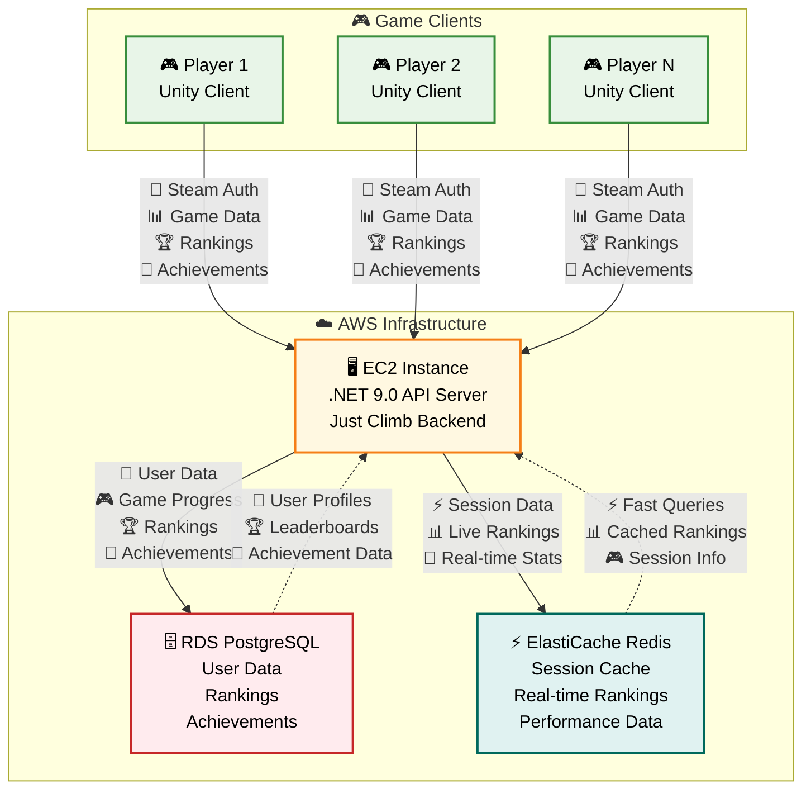
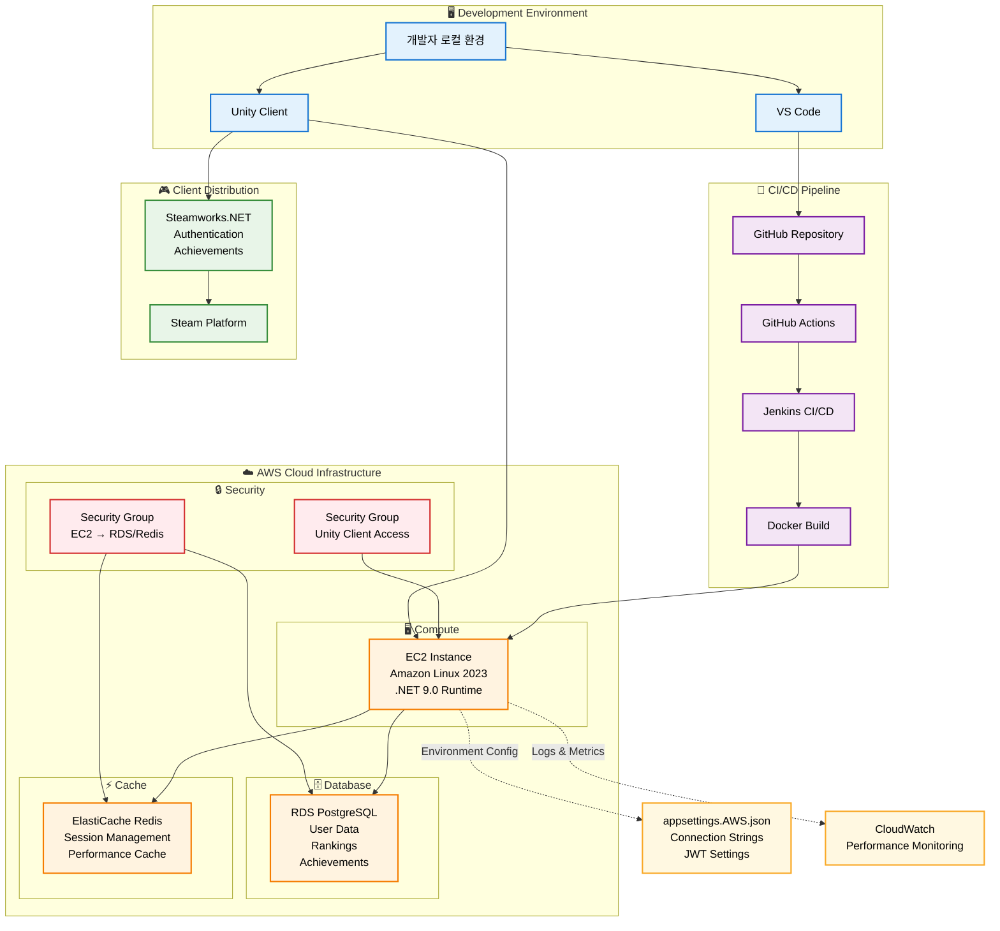

## Just Climb!
🗓️ 프로젝트 개요
- 기간 : 2023.09 ~ 2023.12
- 인원 : 4인 (기획 1, 아트1, 프로그래머 2)
- 역할 : 메인 프로그래머
- 도구 : Unity3D, C#, ASP.NET Core Web API, Entity Framework Core, Steamworks.NET, Redis, Github
- 장르 : 어드벤처, 클라이밍, 3인칭 백뷰 
- 플랫폼 : PC

---

## 프로젝트 설명
- Unity 엔진 기반 3D 백뷰 클라이밍 게임
- 홀드를 이용한 암벽 등반과 장애물을 파훼하여 산 정상에 오르는 게임
- 총 8개 Stage 구성
- **실시간 랭킹 시스템**과 **온라인 데이터 동기화** 기능 포함
- **Steam 연동 시스템**: 로그인 인증, 업적 동기화, 프로필 연동
- **Zenject DI 기반 모듈화 아키텍처**로 확장성과 유지보수성 확보

## 설계서
### Game Flow

- 씬 전환 기반 구조로 타이틀 → 로비 → 스테이지 → 결과로 이어지는 흐름
- 각 Scene은 UI 구조 및 매니저 관리 하에 독립적으로 동작.

### 리팩토링된 계층화 아키텍처 구조 (Steam 연동 + DI 적용)

```mermaid
graph TB
    %% 클라이언트 사이드 (Unity) - 계층화된 구조
    subgraph "🎮 Unity Client - Layered Architecture"
        subgraph "UI Layer (Presentation)"
            UI_Main[UI_Main]
            UI_Lobby[UI_Lobby]
            UI_Stage[UI_Stage]
            UI_Achievement[UI_Achievement]
            UI_Popup[UI_Popup]
            UI_RankingEntry[UI_RankingEntry]
            UI_SyncStatus[UI_SyncStatus]
            UI_Base[UI_Base]
            CharacterSelector[CharacterSelector]
            StartLogo[StartLogo]
            TextColorChange[TextColorChange]
            TutorialTrigger[TutorialTrigger]
            UI_Components[UI Components]
        end
        
        subgraph "Application Layer (Business Logic)"
            RankingManager[RankingManager<br/>✅ Uses DataManager APIs]
            AchievementManager[AchievementManager<br/>✅ Uses DataManager APIs]
            SteamAuthManager[SteamAuthManager<br/>✅ Uses DataManager APIs]
            CurrencyManager[CurrencyManager]
            ItemManager[ItemManager]
            StageManager[StageManager]
            GameManager[GameManager]
        end
        
        subgraph "Domain Layer (Business Services)"
            DataManager[DataManager<br/>🆕 Domain API Provider<br/>✅ GetRanking, UpdateUserRecord<br/>✅ AuthenticateWithSteam<br/>✅ GetAchievements, ClaimReward<br/>✅ MonoBehaviour for Coroutines]
            ItemDatabase[ItemDatabase]
            AchievementIDs[AchievementIDs]
            SaveData[SaveData]
            InventoryItem[InventoryItem]
            DeltaEvent[DeltaEvent]
            ServerConfig[ServerConfig]
        end
        
        subgraph "Infrastructure Layer (Network & System)"
            DataSyncManager[DataSyncManager<br/>🆕 Unified HTTP Communication<br/>✅ GET, POST, PUT, DELETE<br/>✅ JWT Auto-handling<br/>✅ UnityWebRequest Only]
            UIManager[UIManager]
            ResourceManager[ResourceManager]
            SceneManagerEX[SceneManagerEX]
            PoolManager[PoolManager]
            SoundManager[SoundManager]
            BaseScene[BaseScene]
            MainScene[MainScene]
            LobbyScene[LobbyScene]
            StageScene[StageScene]
            SteamManager[SteamManager<br/>Steamworks.NET]
            OfflineCacheManager[OfflineCacheManager<br/>Offline Cache]
            SaveManager[SaveManager]
        end
        
        subgraph "Utilities Layer (Common Helpers)"
            ConfigHelper[ConfigHelper<br/>🆕 Configuration Management<br/>✅ URL Generation<br/>✅ Settings Cache]
            JsonHelper[JsonHelper<br/>🆕 JSON Serialization<br/>✅ SaveData Processing<br/>✅ Delta Value Handling]
            NetworkHelper[NetworkHelper<br/>🆕 Network Utilities<br/>✅ JWT Token Handling<br/>✅ SSL Certificate Bypass<br/>✅ Request Creation]
        end
        
        subgraph "Game Systems"
            ClimbingSystem[ClimbingSystem]
            ObstacleSystem[ObstacleSystem]
            ItemSystem[ItemSystem]
            InputSystem[InputSystem]
            ObstacleCore[Obstacle Core<br/>IObstacle, ObstacleBase]
            ObstacleSpawners[Obstacle Spawners<br/>RockDropper, RollingSpawner]
            ObstacleEffects[Obstacle Effects<br/>KnockbackZone, JumpPad]
            ItemUses[Item Uses<br/>FeatherUse, WingUse, LampUse]
            ItemData[ItemData & IItemUse]
            ItemInput[ItemInput]
        end
        
        subgraph "DI System"
            ProjectInstaller[ProjectInstaller<br/>🆕 Zenject DI]
            MainSceneInstaller[MainSceneInstaller]
            LobbySceneInstaller[LobbySceneInstaller]
            StageSceneInstaller[StageSceneInstaller]
            CharacterSelectInstaller[CharacterSelectInstaller]
            UserIdProvider[UserIdProvider]
        end
    end
    
    %% 서버 사이드 (ASP.NET Core)
    subgraph "🌐 ASP.NET Core Server"
        subgraph "Controllers"
            AuthController[AuthController<br/>🆕 Steam Auth]
            AchievementController[AchievementController<br/>🆕 Achievements]
            RankingController[RankingController]
            SaveController[SaveController]
            DatabaseController[DatabaseController]
        end
        
        subgraph "Services"
            UserService[UserService<br/>🆕 User Management]
            AchievementService[AchievementService<br/>🆕 Achievement Logic]
            RankingService[RankingService]
            UserStateService[UserStateService<br/>🆕 State Management]
        end
        
        subgraph "Models & DTOs"
            User[User Model]
            Achievement[Achievement Model]
            DTOs[DTOs]
            SaveDataServer[SaveData]
        end
        
        subgraph "Database Context"
            JustClimbDbContext[JustClimbDbContext<br/>🆕 EF Core]
            AchievementSeeder[AchievementSeeder]
        end
    end
    
    %% 데이터베이스
    subgraph "🗄️ Database"
        UsersTable[(users)]
        UserItemsTable[(user_items)]
        UserStageRecordsTable[(user_stage_records)]
        AchievementsTable[(achievements<br/>🆕)]
        UserAchievementsTable[(user_achievements<br/>🆕)]
        UserAchievementProgressTable[(user_achievement_progress<br/>🆕)]
    end
    
    %% 외부 시스템
    subgraph "🔗 External Systems"
        SteamWebAPI[Steam Web API<br/>🆕 Ticket Validation]
        SteamworksNET[Steamworks.NET<br/>🆕 Steam Integration]
        RedisCache[Redis Cache<br/>🆕 Performance]
    end
    
    %% 계층간 의존성 관계 (상위 → 하위 계층으로만 의존)
    
    %% UI Layer → Application Layer
    UI_Main --> UIManager
    UI_Lobby --> UIManager
    UI_Stage --> UIManager
    UI_Achievement --> AchievementManager
    UI_RankingEntry --> RankingManager
    UI_SyncStatus --> DataSyncManager
    CharacterSelector --> SteamAuthManager
    UI_Base --> UIManager
    
    %% Application Layer → Domain Layer
    RankingManager -->|도메인 API 호출| DataManager
    AchievementManager -->|도메인 API 호출| DataManager
    SteamAuthManager -->|도메인 API 호출| DataManager
    CurrencyManager --> DataManager
    ItemManager --> DataManager
    StageManager --> DataManager
    GameManager --> DataManager
    
    %% Domain Layer → Infrastructure Layer
    DataManager -->|캡슐화된 네트워크 호출| DataSyncManager
    
    %% Infrastructure Layer → Utilities Layer
    DataSyncManager -->|HTTP 요청 생성| NetworkHelper
    DataSyncManager -->|JSON 처리| JsonHelper
    DataSyncManager -->|설정 로드| ConfigHelper
    DataManager -->|JSON 처리| JsonHelper
    DataManager -->|설정 로드| ConfigHelper
    DataManager -->|네트워크 상태 확인| NetworkHelper
    
    %% Infrastructure 내부 관계
    MainScene --> UIManager
    LobbyScene --> UIManager
    StageScene --> UIManager
    BaseScene --> SceneManagerEX
    UIManager --> ResourceManager
    SteamManager --> SteamAuthManager
    DataSyncManager --> OfflineCacheManager
    
    %% Domain Layer 내부 관계
    DataManager --> SaveData
    DataManager --> DeltaEvent
    DataManager --> ServerConfig
    AchievementManager --> AchievementIDs
    ItemManager --> ItemDatabase
    
    %% Game Systems (독립적)
    ItemManager --> ItemSystem
    ItemSystem --> ItemUses
    ItemUses --> ItemData
    ItemInput --> ItemManager
    
    ObstacleSystem --> ObstacleCore
    ObstacleCore --> ObstacleSpawners
    ObstacleCore --> ObstacleEffects
    
    %% DI System (모든 계층에 주입)
    ProjectInstaller --> UserIdProvider
    ProjectInstaller --> MainSceneInstaller
    ProjectInstaller --> LobbySceneInstaller
    ProjectInstaller --> StageSceneInstaller
    ProjectInstaller --> CharacterSelectInstaller
    
    %% 서버 통신 (DataManager의 도메인 API를 통해 캡슐화됨)
    DataSyncManager -.->|Unified HTTP API| AuthController
    DataSyncManager -.->|Unified HTTP API| RankingController
    DataSyncManager -.->|Unified HTTP API| AchievementController
    
    AuthController --> UserService
    AchievementController --> AchievementService
    RankingController --> RankingService
    SaveController --> UserStateService
    
    UserService --> JustClimbDbContext
    AchievementService --> JustClimbDbContext
    RankingService --> JustClimbDbContext
    UserStateService --> JustClimbDbContext
    
    JustClimbDbContext --> UsersTable
    JustClimbDbContext --> UserItemsTable
    JustClimbDbContext --> UserStageRecordsTable
    JustClimbDbContext --> AchievementsTable
    JustClimbDbContext --> UserAchievementsTable
    JustClimbDbContext --> UserAchievementProgressTable
    
    AuthController -.->|Validate Ticket| SteamWebAPI
    SteamAuthManager -.->|Steam SDK| SteamworksNET
    SteamManager -.->|Steam SDK| SteamworksNET
    AchievementManager -.->|Steam SDK| SteamworksNET
    AchievementService -.->|Cache| RedisCache
    
    %% 스타일링 - 계층별 색상 구분 (밝은 배경에 검은 글자)
    classDef uiLayer fill:#FFE4E1,stroke:#DC143C,stroke-width:2px,color:#000000
    classDef appLayer fill:#E8F5E8,stroke:#4CAF50,stroke-width:2px,color:#000000
    classDef domainLayer fill:#FFF3E0,stroke:#FF9800,stroke-width:2px,color:#000000
    classDef infraLayer fill:#E3F2FD,stroke:#2196F3,stroke-width:2px,color:#000000
    classDef utilLayer fill:#F3E5F5,stroke:#9C27B0,stroke-width:2px,color:#000000
    classDef gameSystem fill:#E6F3FF,stroke:#4169E1,stroke-width:2px,color:#000000
    classDef diSystem fill:#FFF0F5,stroke:#FF69B4,stroke-width:2px,color:#000000
    classDef serverLayer fill:#E6FFE6,stroke:#32CD32,stroke-width:2px,color:#000000
    classDef dbLayer fill:#FFEFD5,stroke:#D2691E,stroke-width:2px,color:#000000
    classDef externalLayer fill:#FFF8DC,stroke:#FF8C00,stroke-width:2px,color:#000000
    classDef newComponent fill:#FFFACD,stroke:#FFD700,stroke-width:3px,color:#000000
    
    %% UI Layer (Presentation)
    class UI_Main,UI_Lobby,UI_Stage,UI_Achievement,UI_Popup,UI_RankingEntry,UI_SyncStatus,UI_Base,CharacterSelector,StartLogo,TextColorChange,TutorialTrigger,UI_Components uiLayer
    
    %% Application Layer (Business Logic)
    class RankingManager,AchievementManager,SteamAuthManager,CurrencyManager,ItemManager,StageManager,GameManager appLayer
    
    %% Domain Layer (Business Services) - 새로 강조
    class DataManager,ItemDatabase,AchievementIDs,SaveData,InventoryItem,DeltaEvent,ServerConfig domainLayer
    
    %% Infrastructure Layer (Network & System)
    class DataSyncManager,UIManager,ResourceManager,SceneManagerEX,PoolManager,SoundManager,BaseScene,MainScene,LobbyScene,StageScene,SteamManager,OfflineCacheManager,SaveManager infraLayer
    
    %% Utilities Layer (Common Helpers) - 새로 추가
    class ConfigHelper,JsonHelper,NetworkHelper utilLayer
    
    %% Game Systems (독립적)
    class ClimbingSystem,ObstacleSystem,ItemSystem,InputSystem,ObstacleCore,ObstacleSpawners,ObstacleEffects,ItemUses,ItemData,ItemInput gameSystem
    
    %% DI System (Dependency Injection)
    class ProjectInstaller,MainSceneInstaller,LobbySceneInstaller,StageSceneInstaller,CharacterSelectInstaller,UserIdProvider diSystem
    
    %% Server Layer
    class AuthController,AchievementController,RankingController,SaveController,DatabaseController,UserService,AchievementService,RankingService,UserStateService,User,Achievement,DTOs,SaveDataServer,JustClimbDbContext,AchievementSeeder serverLayer
    
    %% Database Layer
    class UsersTable,UserItemsTable,UserStageRecordsTable,AchievementsTable,UserAchievementsTable,UserAchievementProgressTable dbLayer
    
    %% External Systems
    class SteamWebAPI,SteamworksNET,RedisCache externalLayer
    
    %% 새로 추가/개선된 컴포넌트 강조
    class DataManager,DataSyncManager,ConfigHelper,JsonHelper,NetworkHelper newComponent
```



**아키텍처 특징:**

### 🏗️ **Zenject DI 기반 6-Layer 모듈화 아키텍처**
- **Service Locator → Dependency Injection 전환**: 강한 의존성 관리 및 테스트 용이성 확보
- **계층별 자동 의존성 주입**: ProjectInstaller를 통한 초기화 순서 보장 및 Scene별 Installer 분리
- **UI 시스템**: 모든 UI 컴포넌트 계층화 (Base, Scene, Popup, Components)
- **6-Layer 분리**: UI → Infrastructure → Domain → Game Systems → Persistence → Sync Layer 명확한 책임 분리
- **Steam 플랫폼 완전 통합**: SteamAuthManager, AchievementManager, SteamManager를 통한 Steam 연동
- **이벤트 기반 실시간 동기화**: DeltaEvent 시스템으로 변경사항만 서버 전송, 오프라인 캐시 지원
- **메모리 및 성능 최적화**: IDisposable 패턴, 오브젝트 풀링, Redis 캐시로 메모리 누수 방지 및 성능 향상

## 주요 구성 요소

### Persistence Layer
- **[DataManager](https://github.com/heejune1209/Just-climb-/blob/main/Assets/Scripts/Managers/DataManager.cs)**  
  - 로컬 JSON(`save.json`) 읽기/쓰기 및 델타 이벤트 시스템 관리
  - `Init()` → 파일 복사/로드, `Load()` → `OnLoaded` 이벤트, `Save()` → `OnSaved` 이벤트
   - **델타 이벤트 시스템**: 데이터 변경 시 `OnDeltaGenerated` 이벤트 발생으로 실시간 동기화
  - `GenerateDelta(key, value)`: 특정 필드 변경사항 추적

- **[SaveData](https://github.com/heejune1209/Just-climb-/blob/main/Assets/Scripts/Data/Models/SaveData.cs)**  
  - 게임 상태 직렬화 모델: `gold`, `gems`, `selectedCharacter`, `items`(InventoryItem[])
  - 스테이지 데이터: `stageClears`, `stageRewards`, `stageTimes`, `stagePlayTimes`, `stageDeathCounts`, `stageFlagPositions`
   - **최고 기록 추적**: `bestClearTimes`, `bestDeathCounts` 추가

- **[InventoryItem](https://github.com/heejune1209/Just-climb-/blob/main/Assets/Scripts/Data/Models/InventoryItem.cs)**  
  - 아이템별 `itemId`·`count` 저장 클래스

- **[DeltaEvent](https://github.com/heejune1209/Just-climb-/blob/main/Assets/Scripts/Data/DeltaEvent.cs)**  
  - 데이터 변경사항 추적을 위한 델타 이벤트 모델

- **[ServerConfig](https://github.com/heejune1209/Just-climb-/blob/main/Assets/Scripts/Data/ServerConfig.cs)**  
  - 서버 URL, API 키 등 설정 관리 ScriptableObject

- **[AchievementIDs](https://github.com/heejune1209/Just-climb-/blob/main/Assets/Scripts/Data/AchievementIDs.cs)**  
  - Steam 업적 ID 상수 정의 및 관리

### Domain Layer
- **[CurrencyManager](https://github.com/heejune1209/Just-climb-/blob/main/Assets/Scripts/Managers/CurrencyManager.cs)**  
  - `DataManager` 이벤트 구독 → 골드/보석 관리  
   - `OnGoldChanged(int)`, `OnGemsChanged(int)`  
   - `GetGold()`, `AddGold()`, `SpendGold()`  

- **[ItemManager](https://github.com/heejune1209/Just-climb-/blob/main/Assets/Scripts/Managers/ItemManager.cs)**  
  - ScriptableObject 기반 아이템 사용 로직 로드  
   - `LoadItemUses()` → `IItemUse` 구현체 자동 등록  
   - 수량·쿨타임·버프 관리, `UseItem()` API  

- **[StageManager](https://github.com/heejune1209/Just-climb-/blob/main/Assets/Scripts/Managers/StageManager.cs)**  
  - 스테이지 클리어 플래그·보상·기록 전담  
   - `SetCleared(stage, gems, time, deaths)`  
   - `OnStageUnlocked`, `OnBestRewardUpdated`, `OnBestTimeUpdated`, `OnBestDeathUpdated`  

- **[RankingManager](https://github.com/heejune1209/Just-climb-/blob/main/Assets/Scripts/Managers/RankingManager.cs)**  
  - **서버 기반 실시간 랭킹 시스템**
  - 클리어 타임 및 사망 횟수 기준 정렬 지원
  - 캐시 기반 성능 최적화
  - `GetRankingWithMyEntry()`: Top N 랭킹과 내 기록 분리 조회
  - 자동 기록 업데이트 (`OnBestTimeUpdated`, `OnBestDeathUpdated` 이벤트 구독)

- **[ItemDatabase](https://github.com/heejune1209/Just-climb-/blob/main/Assets/Scripts/Data/StaticData/ItemDatabase.cs)**  
  - `ItemData.asset` 목록 로드, 아이템 정의 등의 정적 데이터 정보 제공

- **[AchievementManager](https://github.com/heejune1209/Just-climb-/blob/main/Assets/Scripts/Managers/AchievementManager.cs)**  
  - **이벤트 기반 업적 달성 시스템**: 스테이지 클리어, 아이템 사용, 캐릭터 해제 등 게임 이벤트 감지
  - **Steam 업적 연동**: `SteamUserStats.SetAchievement()`, `StoreStats()` 호출로 Steam 업적 동시 달성
  - **서버 동기화**: 델타 이벤트 생성으로 업적 달성 상태 실시간 서버 전송
  - **진행도 추적**: 누적 통계 기반 업적 진행률 관리 및 디버그 출력

- **[SteamAuthManager](https://github.com/heejune1209/Just-climb-/blob/main/Assets/Scripts/Managers/SteamAuthManager.cs)**  
  - **Steam 인증 플로우**: `SteamUser.GetAuthSessionTicket()` → 서버 검증 → JWT 토큰 수신/저장
  - **자동 로그인 시도**: 게임 시작 시 Steam 세션 확인 후 자동 인증 처리
  - **사용자 ID 관리**: Steam ID 기반 사용자 식별 및 프로필 정보 동기화
  - **이벤트 시스템**: `OnAuthenticationSuccess`, `OnAuthenticationFailed` 이벤트 제공

### Infrastructure Layer
- **[ResourceManager](https://github.com/heejune1209/Just-climb-/blob/main/Assets/Scripts/Managers/ResourceManager.cs)**  
  - Unity Resources 시스템 래핑: `Load`/`Instantiate`/`Destroy` 통합 관리

- **[UIManager](https://github.com/heejune1209/Just-climb-/blob/main/Assets/Scripts/Managers/UIManager.cs)**  
  - UI 생명주기 관리: `@UI_Root` 생성 → 씬(`UI_Scene`), 팝업(`UI_Popup`) 인스턴스화
   - Canvas 세팅, 팝업 스택 관리, `Time.timeScale` 제어  
   - **Zenject DI 통합**: 런타임 UI 컴포넌트 자동 의존성 주입

- **[SceneManagerEX](https://github.com/heejune1209/Just-climb-/blob/main/Assets/Scripts/Managers/SceneManagerEX.cs)**  
  - 씬 전환 최적화: 전환 전 `Managers.Clear()` → `SceneManager.LoadScene()` 안전한 씬 로드

- **[SoundManager](https://github.com/heejune1209/Just-climb-/blob/main/Assets/Scripts/Managers/SoundManager.cs)**  
  - 오디오 시스템: BGM/SFX 풀 관리, 볼륨 제어, 사운드 리소스 최적화

- **[PoolManager](https://github.com/heejune1209/Just-climb-/blob/main/Assets/Scripts/Managers/PoolManager.cs)**  
  - 오브젝트 풀링: GameObject 재사용으로 메모리 할당/해제 최적화

- **[GameManager](https://github.com/heejune1209/Just-climb-/blob/main/Assets/Scripts/Managers/GameManager.cs)**  
  - 게임플레이 상태 관리: 플레이 타이머, 사망 카운트, 체크포인트(깃발) 위치 저장/복원

- **씬 관리 시스템**
  - [BaseScene](https://github.com/heejune1209/Just-climb-/blob/main/Assets/Scripts/Scenes/BaseScene.cs): 씬 초기화 추상화 (`Awake()` → `Init()` 가상 호출)
  - [MainScene](https://github.com/heejune1209/Just-climb-/blob/main/Assets/Scripts/Scenes/MainScene.cs), [LobbyScene](https://github.com/heejune1209/Just-climb-/blob/main/Assets/Scripts/Scenes/LobbyScene.cs), [StageScene](https://github.com/heejune1209/Just-climb-/blob/main/Assets/Scripts/Scenes/StageScene.cs): `BaseScene` 상속으로 자동 UI 로드

- **[SteamManager](https://github.com/heejune1209/Just-climb-/blob/main/Assets/Scripts/Steamworks.NET/SteamManager.cs)**  
  - Steamworks.NET 초기화 및 Steam 클라이언트 연동 관리

- **Utilities**  
  - [Define.cs](https://github.com/heejune1209/Just-climb-/blob/main/Assets/Scripts/Utils/Define.cs): 전역 enum/상수  
  - [Util.cs](https://github.com/heejune1209/Just-climb-/blob/main/Assets/Scripts/Utils/Util.cs): 컴포넌트 보장·계층 탐색  
  - [Extension.cs](https://github.com/heejune1209/Just-climb-/blob/main/Assets/Scripts/Utils/Extension.cs): `GameObject` 확장 메서드

### UI Layer
- **UI 계층화**  
  - [UI_Base](https://github.com/heejune1209/Just-climb-/blob/main/Assets/Scripts/UI/UI_Base.cs)
    - 모든 UI 컴포넌트의 공통 바인딩·초기화 로직 포함 (추상 클래스).  
    - **Zenject DI 통합**: `[Inject]` 어트리뷰트로 매니저 자동 주입

  - [UI_Scene](https://github.com/heejune1209/Just-climb-/blob/main/Assets/Scripts/UI/Scene/UI_Scene.cs) : UI_Base  
    - 각 씬 전용 UI 진입점. `Init()` 추상화 → `Awake()` 시 자동 호출.  

  - [UI_Popup](https://github.com/heejune1209/Just-climb-/blob/main/Assets/Scripts/UI/Popup/UI_Popup.cs) : UI_Base  
    - 팝업 UI 전용, 스택 기반 중첩·닫기, `Time.timeScale`·커서 제어.  

- **Scene–UI 호출 관계**  
  - [BaseScene](https://github.com/heejune1209/Just-climb-/blob/main/Assets/Scripts/Scenes/BaseScene.cs) (추상 MonoBehaviour)  
    - `Awake()` 에서 `Init()` 호출 → 가상 메서드 `Init()` 이 자식으로 dispatch  
    - `Clear()` 에서 팝업·씬 UI 정리  

  - **[MainScene](https://github.com/heejune1209/Just-climb-/blob/main/Assets/Scripts/Scenes/MainScene.cs)**, **[LobbyScene](https://github.com/heejune1209/Just-climb-/blob/main/Assets/Scripts/Scenes/LobbyScene.cs)**, **[StageScene](https://github.com/heejune1209/Just-climb-/blob/main/Assets/Scripts/Scenes/StageScene.cs)**  
    - `BaseScene` 상속  
    - `Init()` override 내부에서  
      ```csharp
      Managers.Instance.UI.ShowSceneUI<UI_Main>("UI_Main");
      // 또는 ShowSceneUI<UI_Lobby>, ShowSceneUI<UI_Stage>
      ```  
      을 호출해 해당 씬의 UI 진입점을 띄움  

- **주요 UI 컴포넌트**  
  - **Title Scene**: [`UI_Main`](https://github.com/heejune1209/Just-climb-/blob/main/Assets/Scripts/UI/Scene/UI_Main.cs), [`UI_Achievement`](https://github.com/heejune1209/Just-climb-/blob/main/Assets/Scripts/UI/Popup/UI_Achievement.cs), [`UI_Settings`](https://github.com/heejune1209/Just-climb-/blob/main/Assets/Scripts/UI/Popup/UI_Settings.cs), [`CharacterSelector`](https://github.com/heejune1209/Just-climb-/blob/main/Assets/Scripts/UI/CharacterSelector.cs)
  - **Lobby Scene**: [`UI_Lobby`](https://github.com/heejune1209/Just-climb-/blob/main/Assets/Scripts/UI/Scene/UI_Lobby.cs), [`UI_Shop`](https://github.com/heejune1209/Just-climb-/blob/main/Assets/Scripts/UI/Popup/UI_Shop.cs), [`UI_Warning`](https://github.com/heejune1209/Just-climb-/blob/main/Assets/Scripts/UI/Popup/UI_Warning.cs), `UI_SelectChapter`, [`UI_SelectStage`](https://github.com/heejune1209/Just-climb-/blob/main/Assets/Scripts/UI/Popup/UI_SelectStage.cs), [`UI_GenericInfoPopup`](https://github.com/heejune1209/Just-climb-/blob/main/Assets/Scripts/UI/Popup/GenericInfoPopup.cs), [`UI_Ranking`](https://github.com/heejune1209/Just-climb-/blob/main/Assets/Scripts/UI/Popup/UI_Ranking.cs)
  - **Stage Scene**: [`UI_Stage`](https://github.com/heejune1209/Just-climb-/blob/main/Assets/Scripts/UI/Scene/UI_Stage.cs), [`UI_Inventory`](https://github.com/heejune1209/Just-climb-/blob/main/Assets/Scripts/UI/Scene/UI_Inventory.cs), [`UI_Information`](https://github.com/heejune1209/Just-climb-/blob/main/Assets/Scripts/UI/Popup/UI_Information.cs), `UI_GenericInfoPopup`, [`UI_Result`](https://github.com/heejune1209/Just-climb-/blob/main/Assets/Scripts/UI/Popup/UI_Result.cs), `UI_Warning`

- **추가 UI 컴포넌트**
  - [`UI_RankingEntry`](https://github.com/heejune1209/Just-climb-/blob/main/Assets/Scripts/UI/UI_RankingEntry.cs): 랭킹 목록 엔트리 UI
  - [`UI_SyncStatus`](https://github.com/heejune1209/Just-climb-/blob/main/Assets/Scripts/UI/UI_SyncStatus.cs): 데이터 동기화 상태 표시 UI
  - [`StartLogo`](https://github.com/heejune1209/Just-climb-/blob/main/Assets/Scripts/UI/StartLogo.cs): 게임 시작 로고 애니메이션
  - [`TextColorChange`](https://github.com/heejune1209/Just-climb-/blob/main/Assets/Scripts/UI/TextColorChange.cs): 텍스트 색상 변경 효과
  - [`TutorialTrigger`](https://github.com/heejune1209/Just-climb-/blob/main/Assets/Scripts/UI/TutorialTrigger.cs): 튜토리얼 트리거 시스템

- [UI 시퀀스 다이어그램](https://github.com/heejune1209/Just-climb-/blob/main/UI%20%EC%8B%9C%ED%80%80%EC%8A%A4%20%EB%8B%A4%EC%9D%B4%EC%96%B4%EA%B7%B8%EB%9E%A8.md)
---
### Game Systems Layer
- **아이템 시스템**
  - Item & Currency Structure Class Diagram
    ```mermaid
    classDiagram
    %% UI Layer
    class UI_Shop {
        +BuyItem(itemType, price)
        +UpdateGoldDisplay()
        +UpdateItemDisplay()
        -OnBuyButtonClick()
        -ValidatePurchase()
    }
    
    class UI_Inventory {
        +UpdateItemSlot(itemType, count)
        +ShowCooldown(itemType, remaining)
        +DisplayBuffStatus()
        -OnItemSlotClick()
        -RefreshInventoryUI()
    }
    
    class UI_Base {
        <<abstract>>
        #dataManager: IDataManager
        #currencyManager: ICurrencyManager
        #itemManager: IItemManager
        +Init()
        +Clear()
    }
    
    %% DI System
    class ProjectInstaller {
        +InstallBindings()
        -BindManagers()
        -BindServices()
        -BindInterfaces()
    }
    
    class IDataManager {
        <<interface>>
        +Load()
        +Save()
        +GenerateDelta(key, value)
        +OnLoaded: UnityEvent
        +OnSaved: UnityEvent
        +OnDeltaGenerated: UnityEvent~DeltaEvent~
    }
    
    class ICurrencyManager {
        <<interface>>
        +GetGold(): int
        +GetGems(): int
        +AddGold(amount): bool
        +SpendGold(amount): bool
        +OnGoldChanged: UnityEvent~int~
        +OnGemsChanged: UnityEvent~int~
    }
    
    class IItemManager {
        <<interface>>
        +UseItem(itemType, player): bool
        +AddItem(itemType, count)
        +RemoveItem(itemType, count)
        +GetItemCount(itemType): int
        +OnItemCountChanged: UnityEvent~ItemType, int~
    }
    
    %% Domain Layer
    class CurrencyManager {
        -dataManager: IDataManager
        -syncManager: IDataSyncManager
        +GetGold(): int
        +GetGems(): int
        +AddGold(amount): bool
        +SpendGold(amount): bool
        +AddGems(amount): bool
        +SpendGems(amount): bool
        +OnGoldChanged: UnityEvent~int~
        +OnGemsChanged: UnityEvent~int~
        -HandleDataLoaded()
        -NotifyGoldChange()
        -NotifyGemsChange()
    }
    
    class ItemManager {
        -dataManager: IDataManager
        -itemDatabase: ItemDatabase
        -itemUses: Dictionary~ItemType, IItemUse~
        -cooldowns: Dictionary~ItemType, float~
        +UseItem(itemType, player): bool
        +AddItem(itemType, count)
        +RemoveItem(itemType, count)
        +GetItemCount(itemType): int
        +IsOnCooldown(itemType): bool
        +OnItemCountChanged: UnityEvent~ItemType, int~
        +OnItemUsed: UnityEvent~ItemType~
        -LoadItemUses()
        -SetItemCountInternal(itemType, count)
        -StartCooldown(itemType, duration)
    }
    
    class ItemDatabase {
        -allItems: ItemData[]
        -itemDataMap: Dictionary~ItemType, ItemData~
        +GetItemData(itemType): ItemData
        +GetAllItems(): ItemData[]
        +LoadItemDatabase()
        -BuildItemMap()
    }
    
    %% Persistence Layer
    class DataManager {
        -saveData: SaveData
        -serverConfig: ServerConfig
        -deltaEvents: Queue~DeltaEvent~
        -filePath: string
        +Current: SaveData
        +Load()
        +Save()
        +GenerateDelta(key, value)
        +OnLoaded: UnityEvent
        +OnSaved: UnityEvent
        +OnDeltaGenerated: UnityEvent~DeltaEvent~
        -LoadFromFile()
        -SaveToFile()
        -CreateDeltaEvent(key, oldValue, newValue)
    }
    
    class SaveData {
        +gold: int
        +gems: int
        +selectedCharacter: int
        +items: InventoryItem[]
        +stageClears: bool[]
        +stageRewards: bool[]
        +stageTimes: float[]
        +stagePlayTimes: float[]
        +stageDeathCounts: int[]
        +stageFlagPositions: Vector3[]
        +bestClearTimes: float[]
        +bestDeathCounts: int[]
        +achievements: Dictionary~string, bool~
        +achievementProgress: Dictionary~string, int~
        +GetItemCount(itemType): int
        +SetItemCount(itemType, count)
        +AddItem(itemType, count)
        +RemoveItem(itemType, count)
    }
    
    class InventoryItem {
        +itemId: ItemType
        +count: int
        +InventoryItem(id, count)
        +ToString(): string
    }
    
    class DeltaEvent {
        +key: string
        +oldValue: object
        +newValue: object
        +timestamp: DateTime
        +userId: string
        +DeltaEvent(key, oldValue, newValue)
        +ToJson(): string
    }
    
    class ServerConfig {
        <<ScriptableObject>>
        +serverUrl: string
        +apiKey: string
        +timeoutSeconds: int
        +retryAttempts: int
        +IsProduction: bool
    }
    
    %% Sync Layer
    class DataSyncManager {
        -httpClient: HttpClient
        -serverConfig: ServerConfig
        -dataManager: IDataManager
        -offlineCache: IOfflineCacheManager
        -syncQueue: Queue~DeltaEvent~
        -lastSyncTime: DateTime
        +SyncToServer()
        +SyncFromServer()
        +EnqueueDelta(deltaEvent)
        +OnSyncSuccess: UnityEvent
        +OnSyncFailed: UnityEvent~string~
        -ProcessDeltaBatch()
        -HandleNetworkError(exception)
        -RetrySync()
    }
    
    class OfflineCacheManager {
        -cacheFilePath: string
        -cachedDeltas: List~DeltaEvent~
        +StoreOfflineDeltas(deltas)
        +GetOfflineDeltas(): List~DeltaEvent~
        +ClearOfflineCache()
        +HasOfflineData(): bool
        -SaveToCache()
        -LoadFromCache()
    }
    
    %% Game Systems Layer
    class ItemData {
        <<ScriptableObject>>
        +itemType: ItemType
        +itemName: string
        +description: string
        +icon: Sprite
        +price: int
        +rarity: ItemRarity
        +cooldownDuration: float
        +stackable: bool
        +maxStack: int
        +itemUse: IItemUse
    }
    
    class IItemUse {
        <<interface>>
        +Use(player): bool
        +CanUse(player): bool
        +GetCooldown(): float
        +GetDescription(): string
    }
    
    class FeatherUse {
        +jumpMultiplier: float
        +duration: float
        +Use(player): bool
        +CanUse(player): bool
        +GetCooldown(): float
        +GetDescription(): string
        -ApplyJumpBuff(player)
    }
    
    class WingUse {
        +doubleJumpCount: int
        +duration: float
        +Use(player): bool
        +CanUse(player): bool
        +GetCooldown(): float
        +GetDescription(): string
        -EnableDoubleJump(player)
    }
    
    class LampUse {
        +lightRadius: float
        +duration: float
        +Use(player): bool
        +CanUse(player): bool
        +GetCooldown(): float
        +GetDescription(): string
        -CreateLight(player)
    }
    
    class FlagUse {
        +Use(player): bool
        +CanUse(player): bool
        +GetCooldown(): float
        +GetDescription(): string
        -SetCheckpoint(position)
    }
    
    class ItemInput {
        -itemManager: IItemManager
        -player: GameObject
        -inputMap: Dictionary~KeyCode, ItemType~
        +Update()
        +SetKeyBinding(keyCode, itemType)
        -HandleItemInput(itemType)
        -ShowItemFeedback(itemType, success)
    }
    
    %% Server Layer (ASP.NET Core)
    class SaveController {
        -userService: IUserService
        -userStateService: IUserStateService
        +GetUserState(userId): ActionResult~SaveData~
        +UpdateUserState(userId, saveData): ActionResult
        +ProcessDeltaEvents(userId, deltas): ActionResult
        +SyncUserData(userId): ActionResult
        -ValidateUserId(userId): bool
        -LogUserAction(userId, action)
    }
    
    class IUserService {
        <<interface>>
        +GetUserAsync(steamId): Task~User~
        +CreateUserAsync(steamId, profile): Task~User~
        +UpdateUserAsync(user): Task~User~
        +DeleteUserAsync(steamId): Task~bool~
    }
    
    class UserService {
        -dbContext: JustClimbDbContext
        -cache: IMemoryCache
        +GetUserAsync(steamId): Task~User~
        +CreateUserAsync(steamId, profile): Task~User~
        +UpdateUserAsync(user): Task~User~
        +DeleteUserAsync(steamId): Task~bool~
        -CacheUser(user)
        -InvalidateCache(steamId)
    }
    
    class IUserStateService {
        <<interface>>
        +GetUserStateAsync(userId): Task~SaveData~
        +UpdateUserStateAsync(userId, state): Task~bool~
        +ProcessDeltasAsync(userId, deltas): Task~bool~
        +MergeDeltasAsync(userId, deltas): Task~SaveData~
    }
    
    class UserStateService {
        -dbContext: JustClimbDbContext
        -userService: IUserService
        -cache: IMemoryCache
        +GetUserStateAsync(userId): Task~SaveData~
        +UpdateUserStateAsync(userId, state): Task~bool~
        +ProcessDeltasAsync(userId, deltas): Task~bool~
        +MergeDeltasAsync(userId, deltas): Task~SaveData~
        -ValidateDelta(delta): bool
        -ApplyDeltaToState(state, delta): SaveData
    }
    
    class JustClimbDbContext {
        +Users: DbSet~User~
        +UserItems: DbSet~UserItem~
        +UserStageRecords: DbSet~UserStageRecord~
        +OnConfiguring(optionsBuilder)
        +OnModelCreating(modelBuilder)
        +SaveChangesAsync(): Task~int~
    }
    
    class User {
        +SteamId: string
        +DisplayName: string
        +ProfileUrl: string
        +Gold: int
        +Gems: int
        +SelectedCharacter: int
        +CreatedAt: DateTime
        +UpdatedAt: DateTime
        +LastLoginAt: DateTime
        +UserItems: ICollection~UserItem~
        +StageRecords: ICollection~UserStageRecord~
    }
    
    class UserItem {
        +Id: int
        +SteamId: string
        +ItemType: ItemType
        +Count: int
        +User: User
    }
    
    %% Enums
    class ItemType {
        <<enumeration>>
        Feather
        Wing
        Lamp
        Flag
        HealthPotion
        SpeedBoost
    }
    
    class ItemRarity {
        <<enumeration>>
        Common
        Uncommon
        Rare
        Epic
        Legendary
    }
    
    %% Relationships - UI Layer
    UI_Shop --|> UI_Base
    UI_Inventory --|> UI_Base
    UI_Base --> ICurrencyManager
    UI_Base --> IItemManager
    UI_Base --> IDataManager
    
    %% Relationships - DI System
    ProjectInstaller ..> IDataManager
    ProjectInstaller ..> ICurrencyManager
    ProjectInstaller ..> IItemManager
    ProjectInstaller ..> DataSyncManager
    
    %% Relationships - Domain Layer
    CurrencyManager ..|> ICurrencyManager
    ItemManager ..|> IItemManager
    DataManager ..|> IDataManager
    
    CurrencyManager --> IDataManager
    CurrencyManager --> DataSyncManager
    ItemManager --> IDataManager
    ItemManager --> ItemDatabase
    ItemManager --> IItemUse
    
    %% Relationships - Persistence Layer
    DataManager --> SaveData
    DataManager --> ServerConfig
    DataManager --> DeltaEvent
    SaveData --> InventoryItem
    
    %% Relationships - Sync Layer
    DataSyncManager --> IDataManager
    DataSyncManager --> OfflineCacheManager
    DataSyncManager --> ServerConfig
    DataSyncManager --> DeltaEvent
    
    %% Relationships - Game Systems
    ItemDatabase --> ItemData
    ItemData --> IItemUse
    ItemData --> ItemType
    ItemData --> ItemRarity
    FeatherUse ..|> IItemUse
    WingUse ..|> IItemUse
    LampUse ..|> IItemUse
    FlagUse ..|> IItemUse
    ItemInput --> IItemManager
    
    %% Relationships - Server Layer
    SaveController --> IUserService
    SaveController --> IUserStateService
    UserService ..|> IUserService
    UserStateService ..|> IUserStateService
    UserService --> JustClimbDbContext
    UserStateService --> JustClimbDbContext
    UserStateService --> IUserService
    
    %% Relationships - Database
    JustClimbDbContext --> User
    JustClimbDbContext --> UserItem
    User --> UserItem
    UserItem --> ItemType
    
    %% Network Communication
    DataSyncManager --> SaveController
    ```
  ### **7-Layer 모듈화 구조**
  - **UI Layer**: 상점/인벤토리 사용자 인터페이스
  - **DI System**: Zenject 기반 의존성 주입 시스템  
  - **Domain Layer**: 비즈니스 로직 (재화/아이템 관리)
  - **Persistence Layer**: 데이터 저장 및 직렬화 시스템
  - **Sync Layer**: 실시간 서버 동기화 및 오프라인 캐시
  - **Game Systems**: Strategy Pattern 기반 아이템 효과 시스템
  - **Server Layer**: ASP.NET Core 백엔드 API
  
  ### **핵심 설계 패턴**
  - **Dependency Injection**: 인터페이스 기반 느슨한 결합 및 테스트 용이성
  - **Strategy Pattern**: `IItemUse` 인터페이스로 아이템 효과 확장성 확보
  - **Delta Event System**: 변경사항만 실시간 서버 동기화로 성능 최적화
  - **Repository Pattern**: Entity Framework Core 기반 데이터베이스 추상화
  - **Observer Pattern**: UnityEvent 기반 UI 자동 갱신 시스템
  - [`ItemData`](https://github.com/heejune1209/Just-climb-/blob/main/Assets/Scripts/Items/ItemData.cs) & [`IItemUse`](https://github.com/heejune1209/Just-climb-/blob/main/Assets/Scripts/Items/IItemUse.cs): ScriptableObject + 인터페이스 기반 확장 구조
  - **아이템 구현체**: [`FeatherUse`](https://github.com/heejune1209/Just-climb-/blob/main/Assets/Scripts/Items/FeatherUse.cs)(깃털 - 낙하 감속), [`WingUse`](https://github.com/heejune1209/Just-climb-/blob/main/Assets/Scripts/Items/WingUse.cs)(날개 - 2단 점프), [`LampUse`](https://github.com/heejune1209/Just-climb-/blob/main/Assets/Scripts/Items/LampUse.cs)(램프 - 시야 확장), [`FlagUse`](https://github.com/heejune1209/Just-climb-/blob/main/Assets/Scripts/Items/FlagUse.cs)(깃발 - 체크포인트)
  - [`ItemInput`](https://github.com/heejune1209/Just-climb-/blob/main/Assets/Scripts/Items/ItemInput.cs): 아이템 사용 입력 처리

- [아이템,재화 시스템 시퀀스 다이어그램](https://github.com/heejune1209/Just-climb-/blob/main/%EC%95%84%EC%9D%B4%ED%85%9C%20%EC%8B%9C%ED%80%80%EC%8A%A4%20%EB%8B%A4%EC%9D%B4%EC%96%B4%EA%B7%B8%EB%9E%A8.md)

---
- **장애물 시스템**

  
  - **Core**: [`IObstacle`](https://github.com/heejune1209/Just-climb-/blob/main/Assets/Scripts/Obstacles/Core/IObstacle.cs), [`ObstacleBase`](https://github.com/heejune1209/Just-climb-/blob/main/Assets/Scripts/Obstacles/Core/ObstacleBase.cs), [`ObstacleTrigger`](https://github.com/heejune1209/Just-climb-/blob/main/Assets/Scripts/Obstacles/Core/ObstacleTrigger.cs) - 기본 뼈대 정의
  - **Spawners**: [`RockDropper`](https://github.com/heejune1209/Just-climb-/blob/main/Assets/Scripts/Obstacles/Spawners/RockDropper.cs), [`RollingSpawner`](https://github.com/heejune1209/Just-climb-/blob/main/Assets/Scripts/Obstacles/Spawners/RollingSpawner.cs), [`CannonShooter`](https://github.com/heejune1209/Just-climb-/blob/main/Assets/Scripts/Obstacles/Spawners/CannonShooter.cs) - 장애물 생성
  - **Effects**: [`KnockbackZone`](https://github.com/heejune1209/Just-climb-/blob/main/Assets/Scripts/Obstacles/Effects/KnockbackZone.cs), [`JumpPad`](https://github.com/heejune1209/Just-climb-/blob/main/Assets/Scripts/Obstacles/Effects/JumpPad.cs), [`DeathZone`](https://github.com/heejune1209/Just-climb-/blob/main/Assets/Scripts/Obstacles/Effects/DeathZone.cs), [`MaterialChanger.cs`](https://github.com/heejune1209/Just-climb-/blob/main/Assets/Scripts/Obstacles/Effects/MaterialChanger.cs) 등으로 장애물에 닿았을 때 발생할 충돌 반응이나 특수 효과를 구현.

- **Pooling Support**  
  [`PoolableObstacle.cs`](https://github.com/heejune1209/Just-climb-/blob/main/Assets/Scripts/Obstacles/Utils/PoolableObstacle.cs)는 Object Pooling 기능을 제공하며, `ObstacleBase`를 상속해 장애물 인스턴스를 재사용.  

---

### 랭킹 시스템 구조

- **클라이언트 측**
  - [`RankingManager`](https://github.com/heejune1209/Just-climb-/blob/main/Assets/Scripts/Managers/RankingManager.cs): 서버 통신 및 캐싱 관리
  - [`UI_Ranking`](https://github.com/heejune1209/Just-climb-/blob/main/Assets/Scripts/UI/Popup/UI_Ranking.cs): 랭킹 UI 표시 및 정렬 옵션 제공
  - [`StageManager`](https://github.com/heejune1209/Just-climb-/blob/main/Assets/Scripts/Managers/StageManager.cs) 이벤트 구독을 통한 자동 기록 업데이트

- **서버 측**
  - [`RankingController`](https://github.com/heejune1209/Just-climb-/blob/main/Server/Server/Controllers/RankingController.cs): REST API 엔드포인트
  - [`RankingService`](https://github.com/heejune1209/Just-climb-/blob/main/Server/Server/Services/RankingService.cs): 비즈니스 로직 및 데이터 처리
  - **Entity Framework Core**: 데이터베이스 ORM

- **주요 기능**
  - **실시간 랭킹**: 클리어 타임 및 사망 횟수 기준 정렬
  - **개인 기록 분리**: Top N 랭킹과 내 기록 별도 표시
  - **캐시 최적화**: 중복 요청 방지 및 성능 향상
  - **테스트 데이터**: 개발 및 테스트용 더미 데이터 생성

[랭킹·업적 시스템 시퀀스 다이어그램](https://github.com/heejune1209/Just-climb-/blob/main/%EB%9E%AD%ED%82%B9%C2%B7%EC%97%85%EC%A0%81%20%EC%8B%9C%EC%8A%A4%ED%85%9C%20%EC%8B%9C%ED%80%80%EC%8A%A4%20%EB%8B%A4%EC%9D%B4%EC%96%B4%EA%B7%B8%EB%9E%A8.md)

### 업적 시스템 구조

- **클라이언트 측**
  - [`AchievementIntegration`](https://github.com/heejune1209/Just-climb-/blob/main/Assets/Scripts/Utils/AchievementIntegration.cs): 정적 Facade 클래스로 모든 게임 시스템과 업적 시스템 간 인터페이스 제공
  - [`AchievementManager`](https://github.com/heejune1209/Just-climb-/blob/main/Assets/Scripts/Managers/AchievementManager.cs): Steam API 연동 및 업적 조건 체크
  - [`UI_Achievement`](https://github.com/heejune1209/Just-climb-/blob/main/Assets/Scripts/UI/Popup/UI_Achievement.cs): 업적 목록 표시 및 보상 수령 UI
  - **Steam API Integration**: Steamworks.NET을 통한 실시간 업적 해제

- **서버 측**
  - [`AchievementController`](https://github.com/heejune1209/Just-climb-/blob/main/Server/Server/Controllers/AchievementController.cs): JWT 인증 기반 REST API
  - [`AchievementService`](https://github.com/heejune1209/Just-climb-/blob/main/Server/Server/Services/AchievementService.cs): 업적 상태 관리 및 보상 처리
  - **Database**: 사용자별 업적 진행도 및 보상 상태 저장

- **주요 기능**
  - **Facade Pattern**: `AchievementIntegration`을 통한 느슨한 결합 및 통합된 이벤트 처리
  - **이중 동기화**: Steam API와 서버 DB에 동시 업적 해제
  - **실시간 이벤트**: 게임플레이 중 조건 달성 시 즉시 업적 해제
  - **진행도 추적**: 클라이언트와 서버 양쪽에서 업적 진행 상태 관리
  - **보상 시스템**: 업적 달성 시 게임 내 재화 지급 및 수령 상태 관리
  - **오프라인 지원**: Steam API 실패 시에도 서버 DB 동기화 유지

---

### Steam 연동 시스템 구조

Steam 플랫폼과의 완전한 통합을 위한 3단계 인증 시스템:

1. **클라이언트 (Unity + Steamworks.NET)**
   - `SteamAPI.Init()`: Steam 클라이언트 초기화
   - `SteamAuthManager`: Steam 인증 티켓 생성 및 JWT 토큰 관리
   - `AchievementManager`: Steam 업적과 게임 내 업적 동시 처리

2. **서버 (ASP.NET Core)**
   - [`AuthController`](https://github.com/heejune1209/Just-climb-/blob/main/Server/Server/Controllers/AuthController.cs): Steam Web API로 티켓 검증 후 JWT 발급
   - `AchievementController`: 업적 달성 로직 및 Steam 업적 동기화
   - [`UserService`](https://github.com/heejune1209/Just-climb-/blob/main/Server/Server/Services/UserService.cs): Steam 프로필 정보 동기화 및 사용자 관리

3. **Steam Web API**
   - `AuthenticateUserTicket`: 인증 티켓 유효성 검증
   - Steam 프로필 정보 조회 및 업적 상태 동기화

**인증 플로우:**
```
Unity Client → Steam Ticket → Server Validation → JWT Token → Authenticated Session
```

### 데이터베이스 구조 (Entity Framework Core)

서버 측 데이터베이스는 6개의 정규화된 테이블로 구성되어 있습니다:

- **users**: Steam 기반 사용자 관리 (Steam ID를 Primary Key로 사용)
- **user_items**: 사용자별 아이템 보유 현황
- **user_stage_records**: 스테이지 클리어 기록 및 랭킹 데이터
- **achievements**: 업적 정의 및 메타데이터
- **user_achievements**: 사용자별 업적 달성 상태
- **user_achievement_progress**: 업적 진행도 누적 통계

**주요 특징:**
- **Steam 통합**: SteamID 기반 인증으로 여러 기기에서 데이터 동기화
- **실시간 랭킹**: 인덱스 최적화로 빠른 랭킹 조회
- **업적 시스템**: Steam 업적과 게임 내 업적 동시 관리
- **Redis 캐시**: 자주 조회되는 데이터 캐시로 성능 향상

---

## 주요 기여

### ✅ **Zenject DI 아키텍처로 전환**
- **Service Locator → Dependency Injection 전환**으로 의존성 관리 개선
- **ProjectInstaller**를 통한 계층별 의존성 주입 체계 구축
- **인터페이스 분리**: 각 매니저별 `IManager` 인터페이스 정의로 테스트 용이성 확보
- **자동 초기화**: `IInitializable` 인터페이스로 매니저 초기화 순서 보장

### ✅ **메모리 누수 방지 시스템**
- **IDisposable 패턴**: 모든 매니저에 메모리 누수 방지 로직 구현
- **이벤트 해제**: 매니저 간 이벤트 구독 해제 자동화
- **리소스 정리**: HTTP 클라이언트, 세마포어 등 네이티브 리소스 정리
- **생명주기 관리**: Zenject의 DisposableManager와 연동한 자동 정리

### ✅ **실시간 랭킹 시스템 구현**
- **서버-클라이언트 구조**: ASP.NET Core Web API 기반 백엔드
- **다중 정렬 기준**: 클리어 타임, 사망 횟수 기준 랭킹 지원
- **실시간 동기화**: 기록 갱신 시 자동 서버 업데이트
- **캐시 최적화**: 중복 요청 방지 및 성능 향상
- **UI/UX 개선**: Top N 랭킹과 내 기록 분리 표시

### ✅ **온라인/오프라인 데이터 동기화**
- **델타 이벤트 시스템**: 데이터 변경 사항만 실시간 전송
- **배치 처리**: 5초 간격 주기적 동기화로 서버 부하 최적화
- **오프라인 캐싱**: 네트워크 단절 시 로컬 큐잉 후 복구 시 자동 동기화
- **UI 상태 표시**: 동기화 진행 상황 실시간 피드백

### ✅ UI/UX 시스템 제작
- `UI_Scene`, `UI_Popup` 구조 설계 및 자동화 슬롯 생성 툴 제작
- 이벤트 기반 구조로 UI 갱신을 분리하여 유지보수성과 확장성 강화
- **Zenject DI 통합**: UI 컴포넌트 자동 의존성 주입

### ✅ 아이템·재화 시스템 설계 및 구현
- ScriptableObject + 인터페이스 기반 구조로 설계
- **신규 아이템 추가 시 코드 수정 없이 에셋 등록만으로 반영 가능**
- **`CurrencyManager`/`ItemManager`**: `DataManager` 이벤트 구독 기반으로 골드·보석·아이템 수량 변경 시 `OnGoldChanged`·`OnItemCountChanged` 발행 → UI 자동 동기화

### ✅ 장애물 시스템 모듈화
- 장애물 **트리거 / 스폰 / 효과**를 명확히 분리하여 구조화
- 스폰 주기 및 파라미터를 **ScriptableObject**로 설정 가능하도록 유연하게 설계
- **풀링(Pooling)** 적용으로 실시간 낙석 및 발사 성능 최적화

### ✅ 클라이밍 시스템 분석 및 수정
- 기존 FSM 흐름 분석 후 **벽면 인식 로직 및 이동 제약 조건** 수정
- **경사면 처리 누락** 문제를 직접 해결하여 자연스러운 클라이밍 구현

### ✅ 데이터 관리 및 구조 리펙토링
- **PlayerPrefs → JSON** 전환: `DataManager`/`SaveData` 도입으로 `save.json` 기반 직렬화·역직렬화 구현
- **스테이지 메트릭(Metric)** 확장: 플레이 시간(`stagePlayTimes`), 사망 횟수(`stageDeathCounts`), 깃발 위치(`stageFlagPositions`), 최단 기록(`stageTimes`) 등 `SaveData`에 통합
- **델타 이벤트 시스템**: 데이터 변경 추적 및 실시간 동기화 기반 마련

### ✅ 스테이지 메트릭(Metric)·체크포인트 관리
- **`StageManager`**: 언락 플래그·최고 보상·최단 클리어 타임·최저 사망 횟수 이벤트 기반 갱신
- **`GameManager`**: 씬 로드/언로드 콜백으로 플레이 시간 복원·저장, 체크포인트(깃발) 위치 복원·저장

### ✅ 매니저 컨테이너 & 계층형 아키텍처
* **Zenject DI**: Persistence/Domain/Infrastructure/UI 전 매니저 의존성 주입 및 자동 초기화
* **Clear/Init 패턴**: 씬 전환 시 자동 정리, `BaseScene` 상속 구조로 `Init()` 강제 실행
* **4계층 분리**: Persistence·Domain·Infrastructure·UI 레이어 명확화.
  
### ✅ 캐릭터 능력치 밸런싱

### ✅ **스팀 로그인 연동 시스템 구현**
- **Steamworks.NET 통합**: SteamAPI 초기화 및 인증 티켓 생성
- **JWT 기반 인증**: 스팀 세션 검증 후 JWT 토큰 발급
- **자동 사용자 생성**: SteamID 기반 사용자 레코드 관리
- **Valve Web API 연동**: 서버 측 티켓 검증 시스템
- **완전한 스팀 통합**: 스팀 프로필 정보 동기화 및 세션 관리

### ✅ **업적 시스템 구현**
- **이벤트 기반 업적 달성**: 게임 이벤트 자동 감지 및 업적 언락
- **Steam 업적 연동**: 게임 내 업적과 Steam 업적 동시 달성
- **실시간 동기화**: 델타 이벤트 시스템으로 서버 업적 상태 실시간 업데이트
- **시각적 피드백**: UI_AchievementPopup을 통한 업적 달성 알림
- **캐시 최적화**: Redis 캐시 연동으로 성능 향상

---

## 🔧 **현재 진행중인 작업 내용**

### 🎭 **캐릭터 선택 시스템**
클라이언트 UI → 서버 저장 → 모든 기기에서 동기화

- **클라이언트**
  - **CharacterSelectManager**: UI 버튼 클릭 → `GenerateDelta("selectedCharacter", charId)` 또는 `CharacterService.SetSelectedAsync` 호출
  - **UI_CharacterSelect** 구현: 캐릭터 프리뷰 및 선택 인터페이스
  
- **서버 (ASP.NET Core Web API)**
  - **CharacterController**: `GET /api/users/{uid}/character`, `PUT /api/users/{uid}/character`
  - **IUserCharacterService** + **UserCharacterService**: 델타 병합·UPSERT
  
- **데이터베이스 (Entity Framework Core)**
  - `Add-Migration AddSelectedCharacterColumn` → User 엔티티에 SelectedCharacter 속성 추가
  - **CharacterHistory Entity**: 캐릭터 변경 이력 추적을 위한 엔티티 모델
  - **Repository 패턴**: EF Core 기반 캐릭터 데이터 관리

### 🚀 **AWS 클라우드 인프라 구축 및 서버 배포**

실제 운영 환경을 위한 AWS 기반 인프라 구축 및 자동화 배포 시스템 구현

#### **인프라 구성**
- **AWS EC2**: .NET 9.0 런타임 환경 구성 (Amazon Linux 2023)
- **AWS RDS PostgreSQL**: 사용자 데이터, 랭킹, 업적 정보 저장
- **AWS ElastiCache Redis**: 세션 관리 및 캐시 최적화
- **보안 그룹**: 3-티어 아키텍처 보안 정책 (Unity Client → EC2 → RDS/Redis)

#### **배포 환경 설정**
- **환경별 설정 파일**: `appsettings.json`(로컬), `appsettings.AWS.json`(배포), `appsettings.Production.json`(운영)
- **데이터베이스 연결**: PostgreSQL 연결 문자열 및 Entity Framework Core 마이그레이션
- **.NET 9.0 호환성**: 개발/배포 환경 일관성 확보 및 최신 .NET 기능 활용

#### **배포 자동화 워크플로우**
- **GitHub Actions**: 코드 푸시 시 자동 빌드 및 테스트
- **Jenkins**: CI/CD 파이프라인 구축 및 배포 자동화
- **Docker**: 컨테이너 기반 배포 및 환경 일관성 보장
- **실시간 모니터링**: 서버 상태 및 성능 메트릭 모니터링

### 📊 **배포 자동화 워크플로우 다이어그램**



### 🚀 **향후 개발 계획**
1. **캐릭터 선택 시스템 완성**: 클라이언트 UI → 서버 저장 → 모든 기기에서 동기화
2. **AWS 배포 자동화 완성**: Jenkins/Docker 기반 완전 자동화 배포 파이프라인 구축
3. **성능 최적화**: 실시간 동기화 및 캐시 시스템 개선, CloudWatch 모니터링 강화
4. **추가 업적 컨텐츠**: 더 다양한 업적 조건 및 보상 시스템
5. **로드 밸런싱**: 다중 EC2 인스턴스 및 Application Load Balancer 구성

---

## 관련 링크
### 시연 동영상
https://youtu.be/HkNdxTHhVaw?si=IY2KK07vDpRfTPzP

