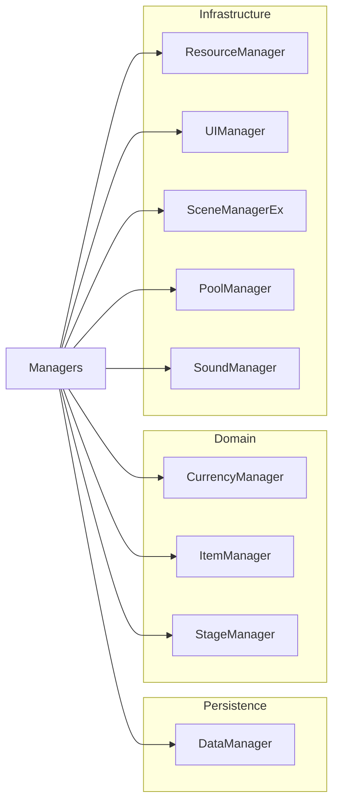

## Just Climb!
🗓️ 프로젝트 개요
- 기간 : 2023.09 ~ 2023.12
- 인원 : 4인 (기획 1, 아트1, 프로그래머 2)
- 역할 : 메인 프로그래머
- 도구 : Unity3D, C#, Github
- 장르 : 어드벤처, 클라이밍, 3인칭 백뷰 
- 플랫폼 : PC

## 프로젝트 설명
- Unity 엔진 기반 3D 백뷰 클라이밍 게임
- 홀드를 이용한 암벽 등반과 장애물을 파훼하여 산 정상에 오르는 게임
- 총 8개 Stage 구성

## 설계서
### Game Flow

- 씬 전환 기반 구조로 타이틀 → 로비 → 스테이지 → 결과로 이어지는 흐름
- 각 Scene은 UI 구조 및 매니저 관리 하에 독립적으로 동작.

### Game Structure

### 주요 구성 요소
- **UI 계층화**  
  - `UI_Base` → `UI_Scene` 상속 구조로 화면(Scene) 단위와 팝업(Popup) 단위 로직을 분리  
  - `UI_Main`, `UI_Lobby`, `UI_Stage` 등 Scene별 진입점과  
    `UI_Settings`, `UI_Shop`, `UI_Inventory` 등 팝업/세부 UI로 구성

- **전체 게임 매니저 (Managers)**  
  - `SceneManagerEX`, `SoundManager`, `ResourceManager`, `UIManager`, `GameManager`, `PoolManager`, `ItemManager`
  - 전역 상태(씬 전환, 사운드, 리소스, UI 팝업, 게임 타이머/체크포인트, 오브젝트 풀 등) 일괄 관리

- **Stage System**  
  - `ItemSystem`, `ClimbingSystem`, `ObstacleSystem`, `InputSystem`  
  - 게임 플레이의 핵심 기능을 모듈화하여 유지·보수성 및 확장성 확보

- **Utilities (Helper) 클래스**  
  - `Define.cs` – 프로젝트 전역 enum/상수  
  - `Util.cs` – 계층 탐색, 컴포넌트 보장 유틸리티  
  - `Extension.cs` – GameObject 확장 메서드
    
### Item Structure

- **Data Layer**: `ItemData.asset` (ScriptableObject)로 공통 필드(id, name, icon 등)를 정의하고, `FeatherData.asset`, `WingData.asset` 등 개별 아이템 데이터를 에셋으로 분리  
- **Logic Layer**: `ItemData.cs`와 `IItemUse` 인터페이스를 통해 `Use()` 메서드를 추상화하고, `FeatherUse.cs`·`WingUse.cs`·`LampUse.cs`·`FlagUse.cs`에서 각 아이템 사용 효과 구현  
- **Management**: `ItemManager.cs`가 에셋 로드, 수량·쿨타임·사용 상태를 종합 관리  
- **UI**: `UI_Inventory.cs`가 슬롯별 아이콘·개수·쿨타임을 화면에 표시하여 플레이어 인벤토리를 시각화

[아이템 다이어그램](https://github.com/heejune1209/Just-climb-/blob/main/%EC%95%84%EC%9D%B4%ED%85%9C%20%EC%8B%9C%ED%80%80%EC%8A%A4%20%EB%8B%A4%EC%9D%B4%EC%96%B4%EA%B7%B8%EB%9E%A8.md)

### Obstacle Structure 

- **Core Interface & Base**  
  `IObstacle.cs`(동작 계약), `ObstacleBase.cs`(Activate/Deactivate 공통 로직), `ObstacleTrigger.cs`(충돌 감지 → IObstacle 호출)로 모든 장애물의 기본 뼈대를 정의.

- **Obstacle Definitions**  
  `ObstacleData.asset`(공통 속성)과 `DropperData.asset`, `RollerData.asset`, `CannonData.asset` 같은 ScriptableObject에 개별 장애물 파라미터를 저장.

- **Spawner Components**  
  `RockDropper.cs`, `RollingSpawner.cs`, `CannonShooter.cs`가 정의된 Data Asset을 읽어 실제 장애물을 씬에 스폰하는 역할.

- **Obstacle Effects**  
  `KnockbackZone.cs`, `JumpPad.cs`, `DeathZone.cs`, `MaterialChanger.cs` 등으로 장애물에 닿았을 때 발생할 충돌 반응이나 특수 효과를 구현.

- **Pooling Support**  
  `PoolableObstacle.cs`는 Object Pooling 기능을 제공하며, `ObstacleBase`를 상속해 장애물 인스턴스를 재사용.  

## 주요 기여

### ✅ UI/UX 시스템 제작
- `UI_Scene`, `UI_Popup` 구조 설계 및 자동화 슬롯 생성 툴 제작
- 이벤트 기반 구조로 UI 갱신을 분리하여 유지보수성과 확장성 강화

### ✅ 아이템 시스템 설계 및 구현
- ScriptableObject + 인터페이스 기반 구조로 설계
- **신규 아이템 추가 시 코드 수정 없이 에셋 등록만으로 반영 가능**
- 쿨타임, 수량, UI 반영을 모두 `ItemManager`에서 일괄 처리

### ✅ 장애물 시스템 모듈화
- 장애물 **트리거 / 스폰 / 효과**를 명확히 분리하여 구조화
- 스폰 주기 및 파라미터를 **ScriptableObject**로 설정 가능하도록 유연하게 설계
- **풀링(Pooling)** 적용으로 실시간 낙석 및 발사 성능 최적화

### ✅ 클라이밍 시스템 분석 및 수정
- 기존 FSM 흐름 분석 후 **벽면 인식 로직 및 이동 제약 조건** 수정
- **경사면 처리 누락** 문제를 직접 해결하여 자연스러운 클라이밍 구현
  
### ✅ 캐릭터 능력치 밸런싱

## 🔧 **향후 개선 계획**
- ⏱ 스테이지별 클리어 타임 기반 랭킹 시스템 도입

  - **클라이언트**
    - `RankingManager`/`UI_Leaderboard` 구현 → 스테이지 클리어 시 `DataManager` 델타 이벤트(값이 바뀔 때마다 어떤 데이터가 어떻게 변했는지 알려주는 이벤트)로 `{ key:"ranking:stage1", value:time }` 발행
    - `DataSyncManager` 에 델타 이벤트 전송 로직 추가 → `/api/users/{uid}/ranking` 호출
    - `UI_SyncStatus`로 “랭킹 동기화 중/완료/실패” 표시
    
  - **서버 (ASP .NET Core Web API)**
    - **RankingController** (`POST /api/users/{uid}/ranking`, `GET /api/users/{uid}/ranking?stage=`)
    - **IUserRankingService** -> 랭킹 기록 검증·Redis Sorted Set에 저장
    - **ConflictResolver** -> 타임스탬프·최저 기록만 허용

  - **데이터베이스 & 캐시**
    - `rankings` 테이블: (`user_id`, `stage`, `clear_time`, `recorded_at`)
    - Redis Sorted Set (`ranking:stage1`) -> 실시간 상위 N명 조회
    - `RedisSyncConfig.json` 으로 TTL/인덱스 설정
  
- 🎮 **클라이밍 조작 보정 및 최적화**
  - 현재 클라이밍 방식은 조작키와 플레이어가 바라보고 있는 방향으로 가장 가까운 홀드로 이동을 하지만,
  - 이 부분이 클라이밍을 할때 플레이어가 원하는 홀드로 이동이 안될수 있음을 파악했음.
  - 입력 방향과 카메라 시선 가중치 기반으로 플레이어가 의도한 홀드를 우선 선택하도록 개선

- 💾 **데이터 관리 개선 (델타 이벤트 기반 오프라인→온라인 싱크)**  
  - **클라이언트**
    - **DataManager**
      - 기존 JSON 저장/로드(`save.json`) 그대로 유지
      - `OnDeltaGenerated(Delta d)` 이벤트 추가 (key, value, timestamp)

    - **DataSyncManager**
      - 델타 큐잉·주기적 배치 전송(5초)
      - `OnApplicationPause/Quit` 시 즉시 Flush
      - 실패 시 재큐잉 및 재시도
  
    - **OfflineCacheManager**
      - 네트워크 상태 감지 → 싱크 일시중단/재개
    
    - **UI\_SyncStatus**
      - 화면 우측 상단에 “🟢 동기화 OK / 🟡 대기 중 / 🔴 오류” 표시

  - **서버 (ASP .NET Core Web API)**
    - **SaveController** : `POST /api/users/{uid}/state/delta` 엔드포인트 구현
    - **AuthService**: JWT 인증·인가
    - **ConflictResolver**: 델타 타임스탬프·버전 기반 병합
    - **UserStateService**: DB `users`·`user_items` UPSERT 로직

  - **데이터베이스 & 캐시**
    - `users` 테이블: (`user_id`, `gold`, `gems`, `selected_character`, `flag_x,y,z`)
    - `user_items` 테이블: (`user_id`, `item_type`, `count`) — UPSERT 쿼리
    - Redis: 랭킹 외에도 “최근 델타 처리 시간” 캐시용

- 🎭 **캐릭터 선택 기능 설계 개선**
  - **클라이언트**
    - **CharacterData** SO + `CharacterDatabase`
    - **UI\_SelectCharacter**: 아이콘 클릭 → 프리뷰(`Managers.UI`) → 확정
    - `DataManager` 델타 이벤트: `{ key:"character", value:selectedId }` 발행
      
  - **서버 (ASP .NET Core Web API)**
    - **CharacterController** (`POST /api/users/{uid}/character`)
    - **UserStateService.SaveCharacterAsync** → `users.selected_character` 업데이트
      
  - **데이터베이스**
    - `users.selected_character` 컬럼
    - `user_character_history` 테이블로 변경 로그 보관

- **전체 파이프라인 요약**
  1. **클라이언트**: 로컬 JSON -> Δ(델타) 생성 -> `DataSyncManager` 주기 전송/재시도 -> UI 표시
  2. **서버**: ASP .NET Core Web API -> 인증·검증 → `ConflictResolver` -> DB/Redis 반영
  3. **DB/Redis**: 정규화 테이블 + 캐시 로직 → 실시간 랭킹·상태 조회

## 기술 스택 및 개발 환경
C#, Unity3D, Visual Studio 2022

## 관련 링크
### 시연 동영상
https://youtu.be/HkNdxTHhVaw?si=IY2KK07vDpRfTPzP

