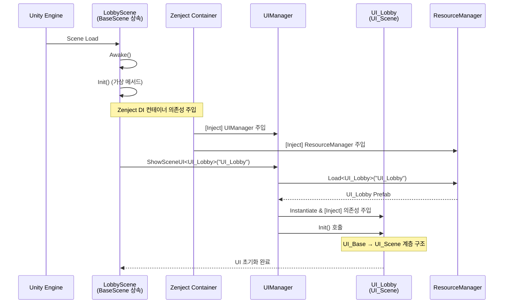
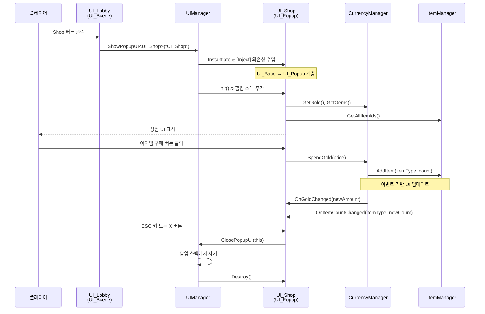
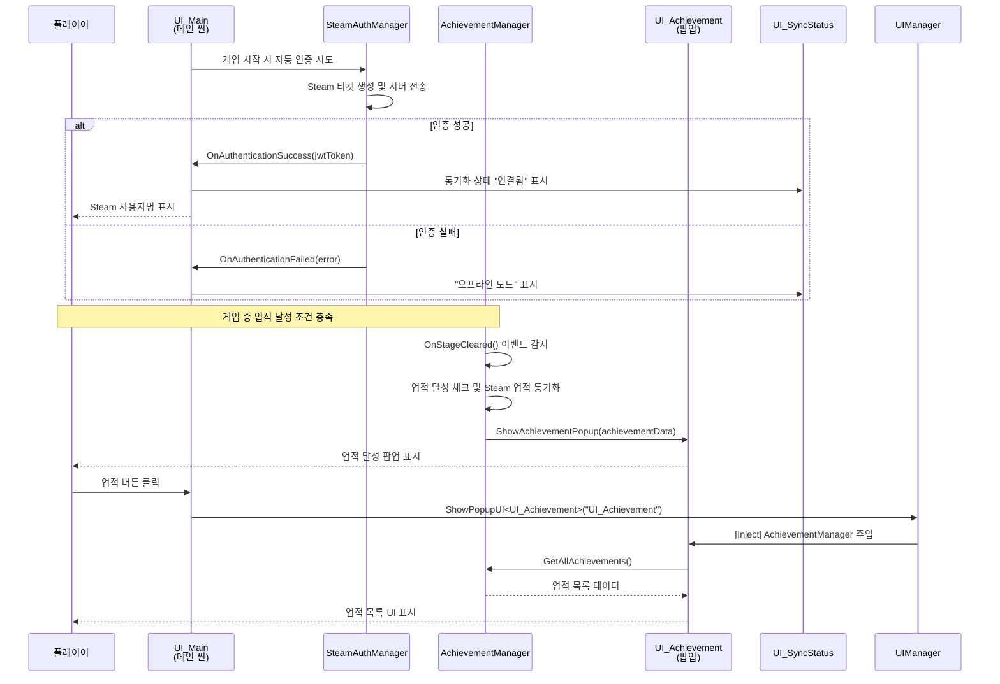
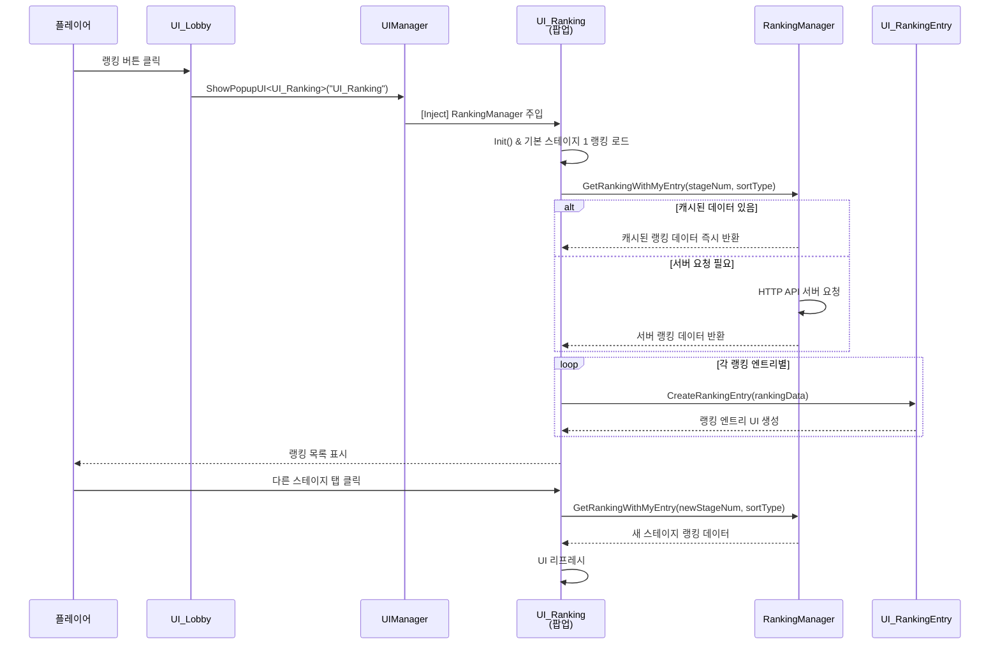
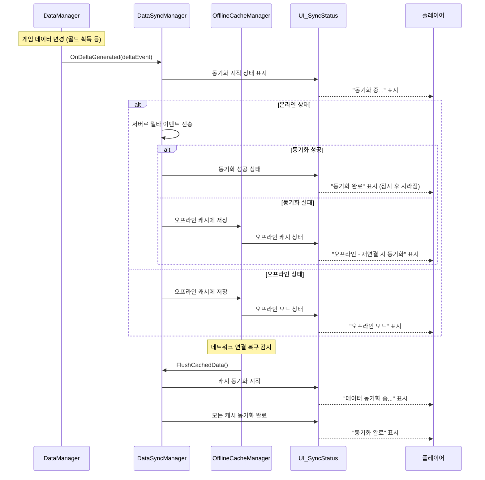

# UI 시퀀스 다이어그램

## 1) 씬 초기화 및 UI 로드 플로우 (BaseScene + Zenject DI)

## 2) 팝업 시스템 플로우 (UI_Scene → UI_Popup)

## 3) Steam 인증 및 업적 시스템 플로우

## 4) 랭킹 시스템 UI 플로우

## 5) 데이터 동기화 상태 UI 플로우

## 주요 특징

### 🏗️ **아키텍처 반영사항**
- **BaseScene 상속 구조**: `Awake()` → `Init()` 가상 메서드 호출 패턴
- **Zenject DI 통합**: `[Inject]` 어트리뷰트를 통한 자동 의존성 주입
- **UI 계층화**: UI_Base → UI_Scene/UI_Popup 상속 구조
- **이벤트 기반 UI 업데이트**: 매니저들의 이벤트 구독으로 UI 자동 갱신

### 🔄 **실시간 동기화**
- **델타 이벤트 시스템**: 변경사항만 추적하여 서버 전송
- **오프라인 캐싱**: 네트워크 단절 시 로컬 저장 후 복구 시 자동 동기화
- **UI 상태 표시**: 동기화 진행 상황 실시간 피드백

### 🎮 **Steam 통합**
- **자동 인증**: 게임 시작 시 Steam 세션 확인 및 서버 인증
- **업적 시스템**: 게임 내 업적과 Steam 업적 동시 달성
- **사용자 경험**: Steam 프로필 정보 표시 및 연동 상태 안내
