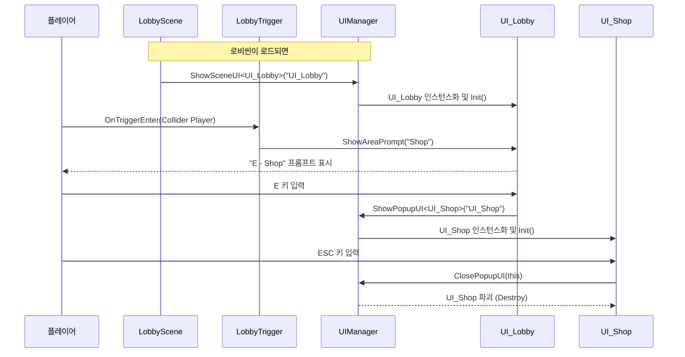

1) 상점에서 아이템 구매 흐름
- Player → UI_Shop → ItemManager → PlayerPrefs → UI 갱신까지의 흐름

```mermaid
sequenceDiagram
    %% 참여자 정의
    participant Player     as 플레이어
    participant LobbyScene as LobbyScene
    participant LobbyTrigger as LobbyTrigger
    participant UIManager  as UIManager
    participant UI_Lobby   as UI_Lobby
    participant UI_Shop    as UI_Shop

    %% 1) 로비 씬 로드 및 UI_Lobby 생성
    Note over LobbyScene, UIManager: 로비씬이 로드되면
    LobbyScene->>UIManager: ShowSceneUI<UI_Lobby>("UI_Lobby")
    UIManager->>UI_Lobby: UI_Lobby 인스턴스화 및 Init()

    %% 2) 플레이어가 Shop 영역에 진입
    Player->>LobbyTrigger: OnTriggerEnter(Collider Player)
    LobbyTrigger->>UI_Lobby: ShowAreaPrompt("Shop")
    UI_Lobby-->>Player: "E - Shop" 프롬프트 표시

    %% 3) 플레이어가 E 키 입력 → 상점 팝업 열기
    Player->>UI_Lobby: E 키 입력
    UI_Lobby->>UIManager: ShowPopupUI<UI_Shop>("UI_Shop")
    UIManager->>UI_Shop: UI_Shop 인스턴스화 및 Init()

    %% 4) ESC 키 입력 → 팝업 닫기
    Player->>UI_Shop: ESC 키 입력
    UI_Shop->>UIManager: ClosePopupUI(this)
    UIManager-->>UI_Shop: UI_Shop 파괴 (Destroy)

```
