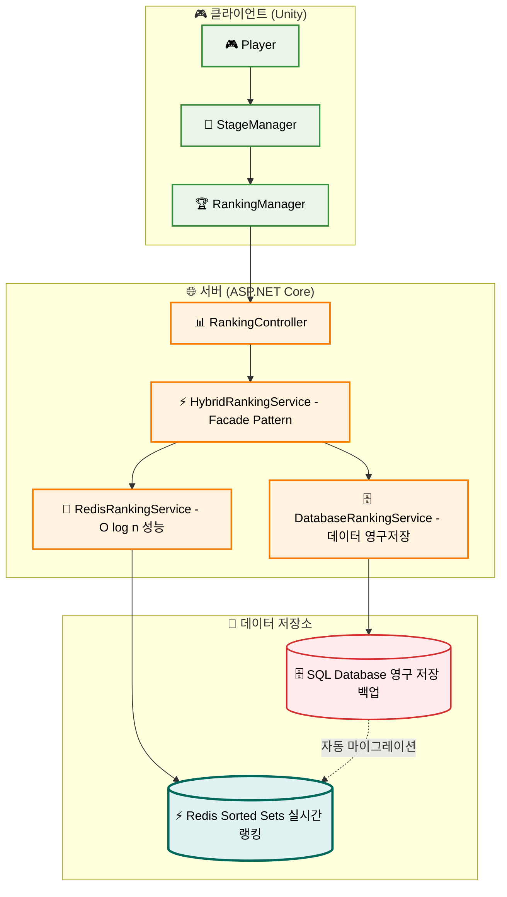
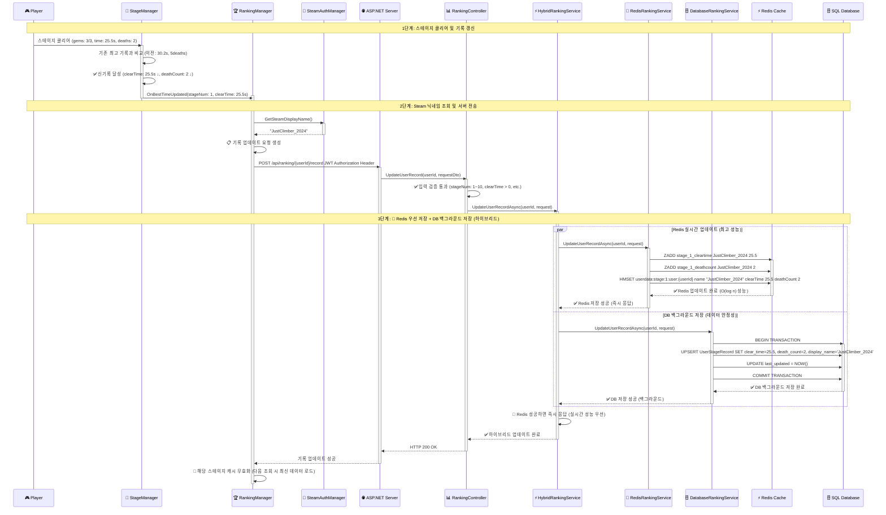
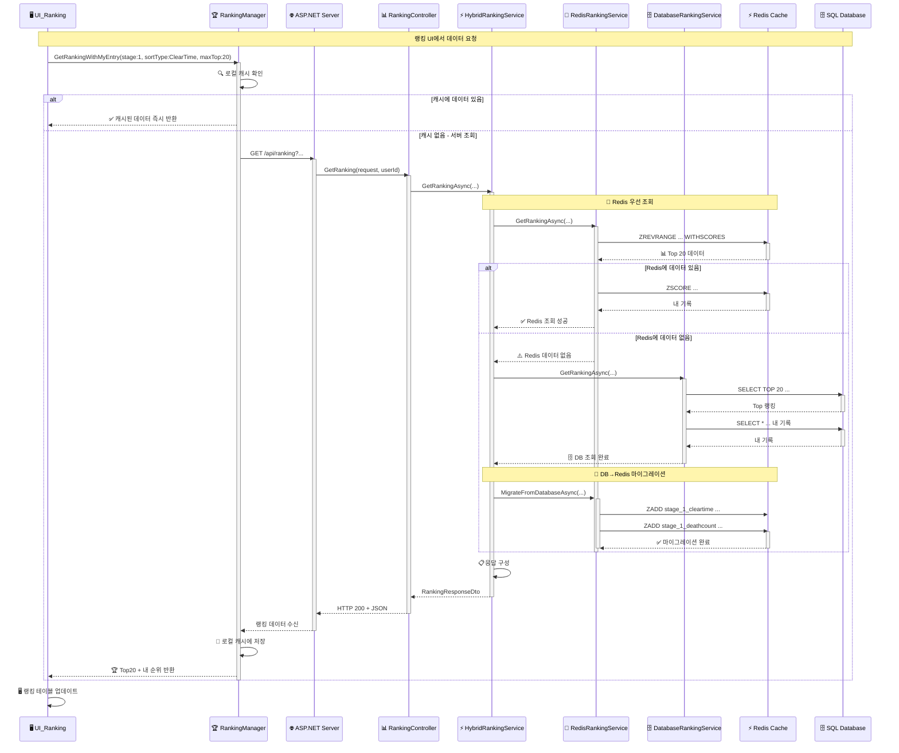
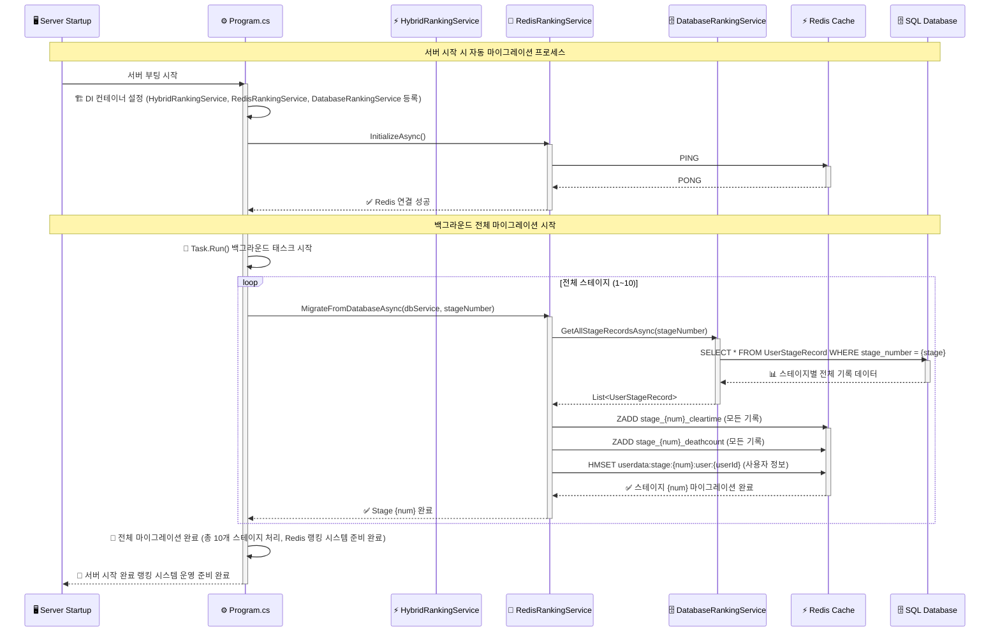
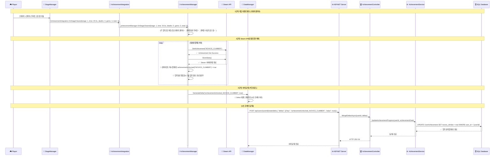
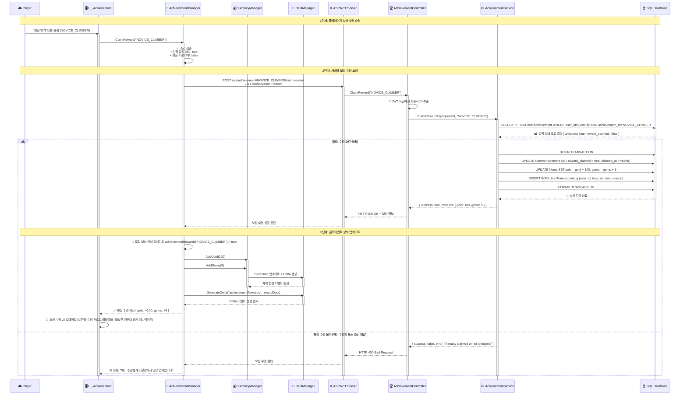
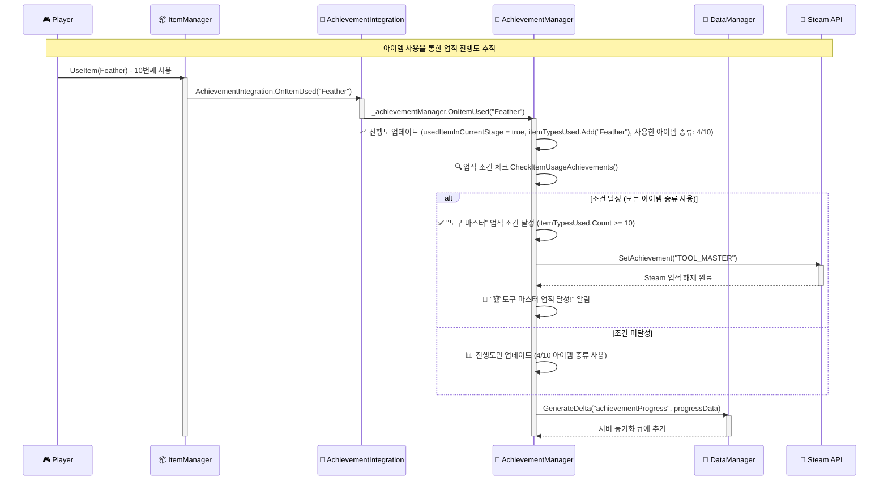

# 랭킹·업적 시스템 시퀀스 다이어그램

---

## **🚀 Redis 기반 하이브리드 랭킹 시스템 흐름**

### 📊 **시스템 아키텍처 개요**

### 1) **스테이지 클리어 + Redis 하이브리드 랭킹 업데이트 흐름**
**게임플레이 → 기록 갱신 → Redis 우선 저장 → DB 백그라운드 저장 → 실시간 랭킹 업데이트**

### 2) **Redis 하이브리드 랭킹 조회 및 자동 마이그레이션 흐름**
**UI 요청 → Redis 우선 조회 → 없으면 DB 조회 후 Redis 마이그레이션 → 캐시 업데이트**

### 3) **서버 시작 시 자동 DB → Redis 마이그레이션 흐름**
**서버 부팅 → Redis 초기화 → 전체 스테이지 데이터 마이그레이션 → 랭킹 시스템 준비 완료**

---

## **🎯 하이브리드 랭킹 시스템 특징**

### **⚡ Redis 기반 실시간 성능**
- **O(log n) 시간복잡도**: Redis Sorted Set으로 초고속 랭킹 처리
- **즉시 응답**: 기록 업데이트 시 Redis 성공하면 즉시 클라이언트 응답
- **실시간 조회**: 캐시된 랭킹 데이터로 밀리초 단위 조회 성능

### **🗄️ Database 기반 데이터 안정성**  
- **영구 저장**: 모든 기록이 SQL Database에 영구적으로 저장
- **백그라운드 저장**: Redis 업데이트 후 DB 저장을 백그라운드에서 처리
- **데이터 무결성**: Redis 실패 시 DB로 폴백하여 데이터 손실 방지

### **🔄 자동 마이그레이션 시스템**
- **서버 시작 시**: 전체 DB 데이터를 Redis로 자동 마이그레이션
- **런타임 마이그레이션**: Redis에 데이터가 없으면 DB에서 조회 후 즉시 캐시
- **백그라운드 처리**: 마이그레이션 작업이 클라이언트 응답에 영향 없음

### **🎮 클라이언트 호환성**
- **API 변경 없음**: 기존 `IRankingService` 인터페이스 유지
- **투명한 업그레이드**: 클라이언트 코드 수정 없이 성능 향상
- **기존 UI 유지**: `RankingManager`, `UI_Ranking` 등 모든 UI 그대로 사용

### **📊 모니터링 및 헬스체크**
- **랭킹 헬스체크**: `/api/v1/health/ranking` 엔드포인트로 Redis 상태 확인
- **실시간 로깅**: Redis/DB 각 단계별 상세 로깅 및 성능 추적
- **장애 복구**: Redis 장애 시 자동 DB 폴백 및 복구 시 재마이그레이션 

---

## **🏆 업적 시스템 흐름**

### 4) **업적 달성 감지 및 해제 흐름**
**게임 이벤트 → AchievementIntegration → 조건 체크 → Steam API 호출 → 서버 동기화 → 알림 표시**

### 5) **업적 보상 수령 흐름**
**UI에서 보상 요청 → 서버 검증 → 재화 지급 → 상태 업데이트**

### 6) **업적 진행도 실시간 추적 흐름**
**아이템 사용 → AchievementIntegration → 진행도 누적 → 조건 달성 체크 → 자동 업적 해제**

---

## **📋 시스템 특징 및 아키텍처**

### **⚡ 하이브리드 랭킹 시스템 특징**
- **실시간 기록 업데이트**: `StageManager.OnBestTimeUpdated` 이벤트 기반 자동 서버 전송
- **3-Layer 캐시 구조**: Redis (서버) + Dictionary (클라이언트) + 자동 마이그레이션 계층 캐싱으로 성능 최적화
- **Top N + 내 기록 분리**: 상위 랭킹과 개인 기록을 별도 조회하여 UI 최적화
- **중복 요청 방지**: `_pendingUpdates` HashSet으로 동일 스테이지 연속 요청 차단
- **Steam 닉네임 연동**: Steam 프로필 정보 자동 동기화 및 표시
- **Facade Pattern**: `HybridRankingService`가 Redis + Database 복잡성을 추상화
- **장애 복구**: Redis 실패 시 자동 DB 폴백, 복구 시 재마이그레이션

### **🏆 업적 시스템 특징**  
- **Facade Pattern**: `AchievementIntegration` 정적 클래스가 복잡한 `AchievementManager`에 대한 단순한 인터페이스 제공
- **느슨한 결합**: 다른 매니저들이 `AchievementManager`에 직접 의존하지 않고 `AchievementIntegration`을 통해 통신
- **통합된 이벤트 채널**: 모든 게임 이벤트가 `AchievementIntegration`을 통해 일관된 방식으로 처리
  - `GameManager` → `OnStageStart()`, `OnPlayerDeath()`
  - `StageManager` → `OnStageCleared()`
  - `ItemManager` → `OnItemUsed()`, `OnItemPurchased()`
- **이중 플랫폼 동기화**: Steam API + 서버 DB 동시 업적 해제로 데이터 무결성 보장
- **실시간 조건 체크**: 게임 이벤트 발생 즉시 업적 조건 검증 및 해제
- **진행도 추적**: 누적형 업적을 위한 상세 진행 상태 관리 (`AchievementProgress`)
- **보상 시스템**: 업적 달성 시 게임 내 재화(골드/젬) 자동 지급
- **오프라인 지원**: Steam API 실패 시에도 서버 DB 동기화로 데이터 손실 방지
- **Delta 동기화**: 배치 처리를 통한 업적 상태 서버 전송으로 네트워크 효율성 최적화 
