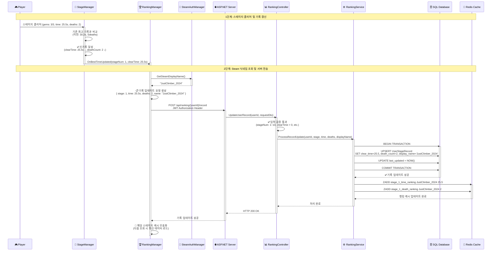
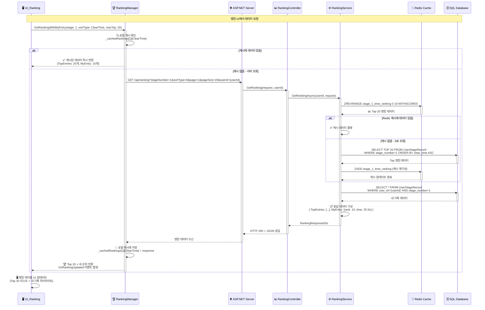
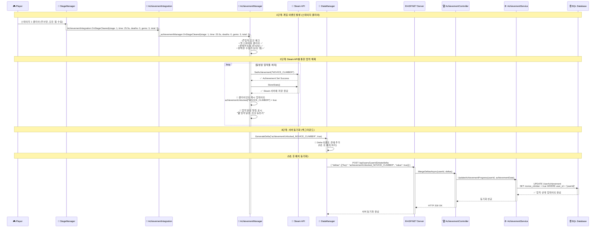
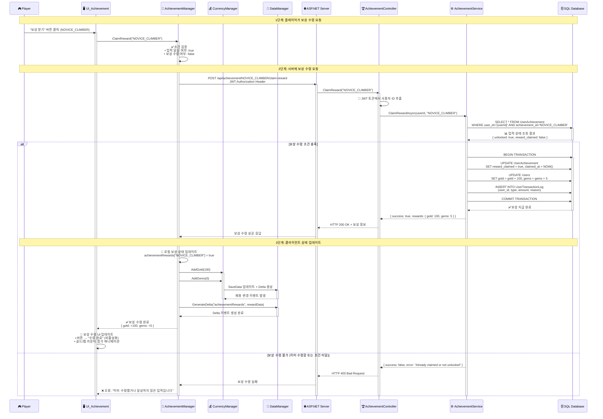
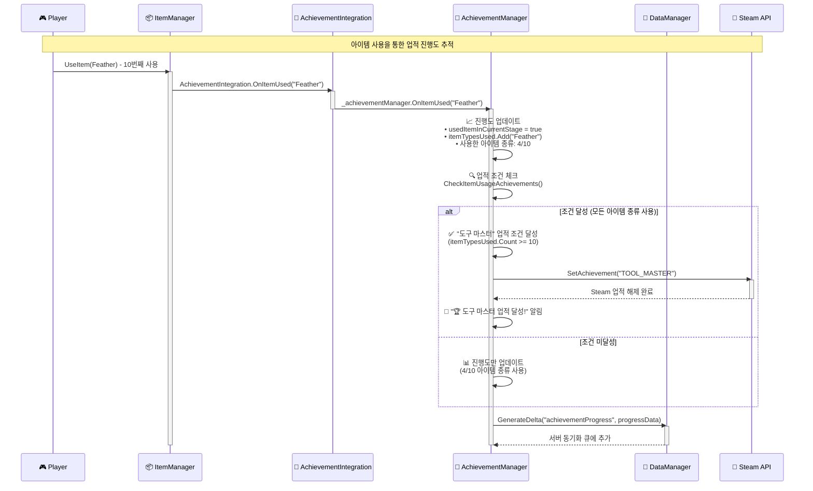

# 랭킹·업적 시스템 시퀀스 다이어그램

---

## **랭킹 시스템 흐름**

### 1) 스테이지 클리어 + 랭킹 업데이트 흐름
**게임플레이 → 기록 갱신 → 서버 전송 → 랭킹 업데이트 → 캐시 갱신**

### 2) 랭킹 조회 및 캐시 관리 흐름
**UI 요청 → 캐시 확인 → 서버 조회 → Top N + 내 기록 분리 → UI 표시**

---

## **업적 시스템 흐름**

### 3) 업적 달성 감지 및 해제 흐름
**게임 이벤트 → AchievementIntegration → 조건 체크 → Steam API 호출 → 서버 동기화 → 알림 표시**

### 4) 업적 보상 수령 흐름
**UI에서 보상 요청 → 서버 검증 → 재화 지급 → 상태 업데이트**

### 5) 업적 진행도 실시간 추적 흐름
**아이템 사용 → AchievementIntegration → 진행도 누적 → 조건 달성 체크 → 자동 업적 해제**

---

## **시스템 특징 및 아키텍처**

### **랭킹 시스템 특징**
- **실시간 기록 업데이트**: `StageManager.OnBestTimeUpdated` 이벤트 기반 자동 서버 전송
- **이중 캐시 구조**: Redis (서버) + Dictionary (클라이언트) 계층 캐싱으로 성능 최적화
- **Top N + 내 기록 분리**: 상위 랭킹과 개인 기록을 별도 조회하여 UI 최적화
- **중복 요청 방지**: `_pendingUpdates` HashSet으로 동일 스테이지 연속 요청 차단
- **Steam 닉네임 연동**: Steam 프로필 정보 자동 동기화 및 표시

### **업적 시스템 특징**  
- **Facade Pattern**: `AchievementIntegration` 정적 클래스가 복잡한 `AchievementManager`에 대한 단순한 인터페이스 제공
- **느슨한 결합**: 다른 매니저들이 `AchievementManager`에 직접 의존하지 않고 `AchievementIntegration`을 통해 통신
- **통합된 이벤트 채널**: 모든 게임 이벤트가 `AchievementIntegration`을 통해 일관된 방식으로 처리
  - `GameManager` → `OnStageStart()`, `OnPlayerDeath()`
  - `StageManager` → `OnStageCleared()`
  - `ItemManager` → `OnItemUsed()`, `OnItemPurchased()`
- **이중 플랫폼 동기화**: Steam API + 서버 DB 동시 업적 해제로 데이터 무결성 보장
- **실시간 조건 체크**: 게임 이벤트 발생 즉시 업적 조건 검증 및 해제
- **진행도 추적**: 누적형 업적을 위한 상세 진행 상태 관리 (`AchievementProgress`)
- **보상 시스템**: 업적 달성 시 게임 내 재화(골드/젬) 자동 지급
- **오프라인 지원**: Steam API 실패 시에도 서버 DB 동기화로 데이터 손실 방지
- **Delta 동기화**: 배치 처리를 통한 업적 상태 서버 전송으로 네트워크 효율성 최적화 