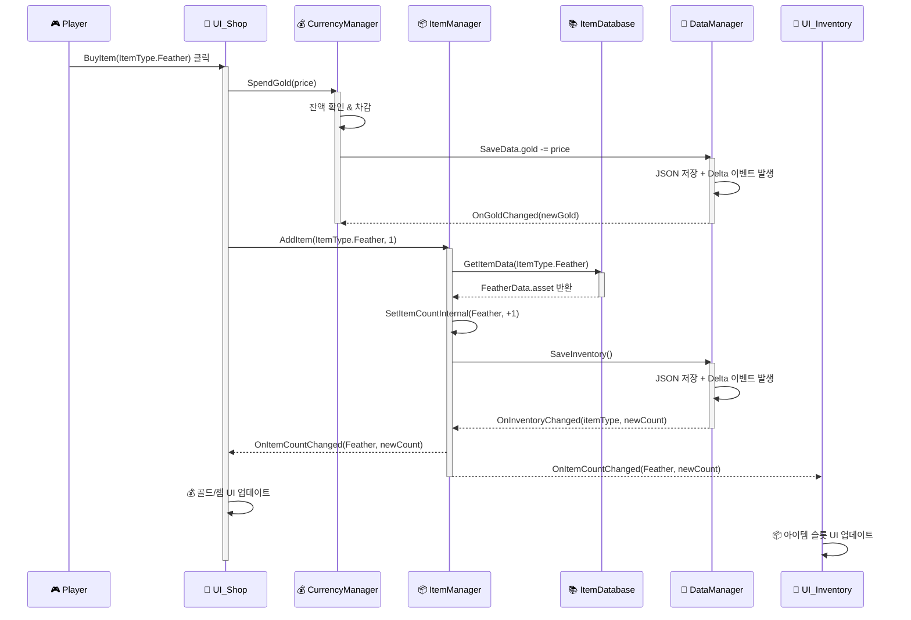
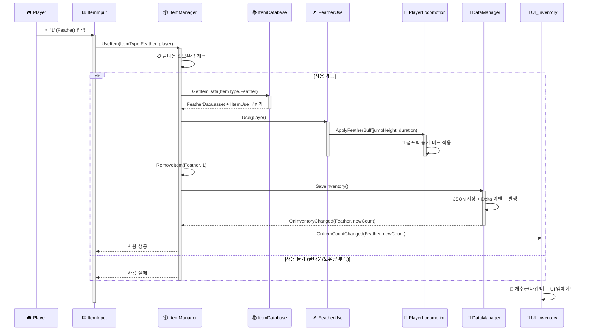
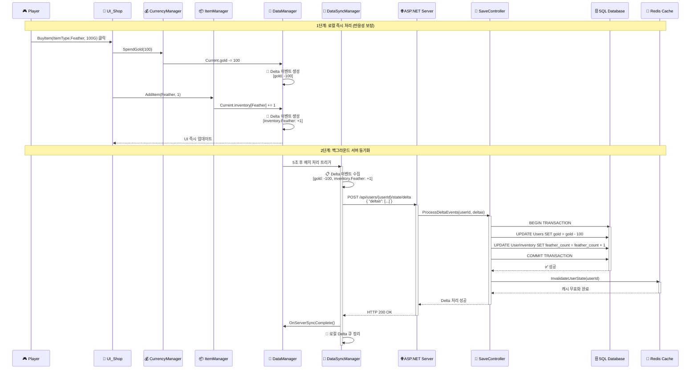
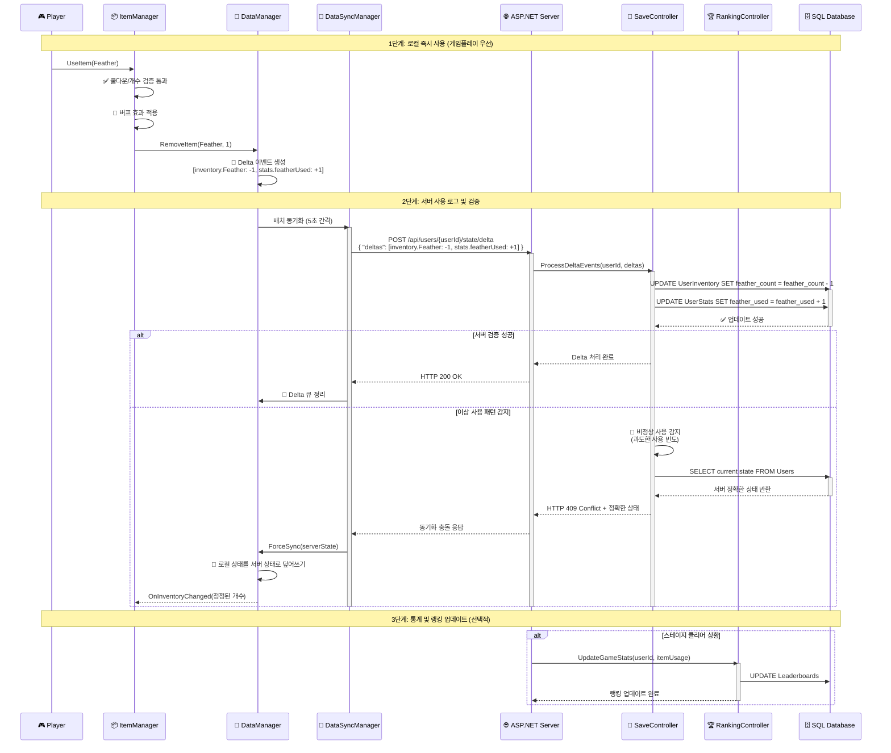
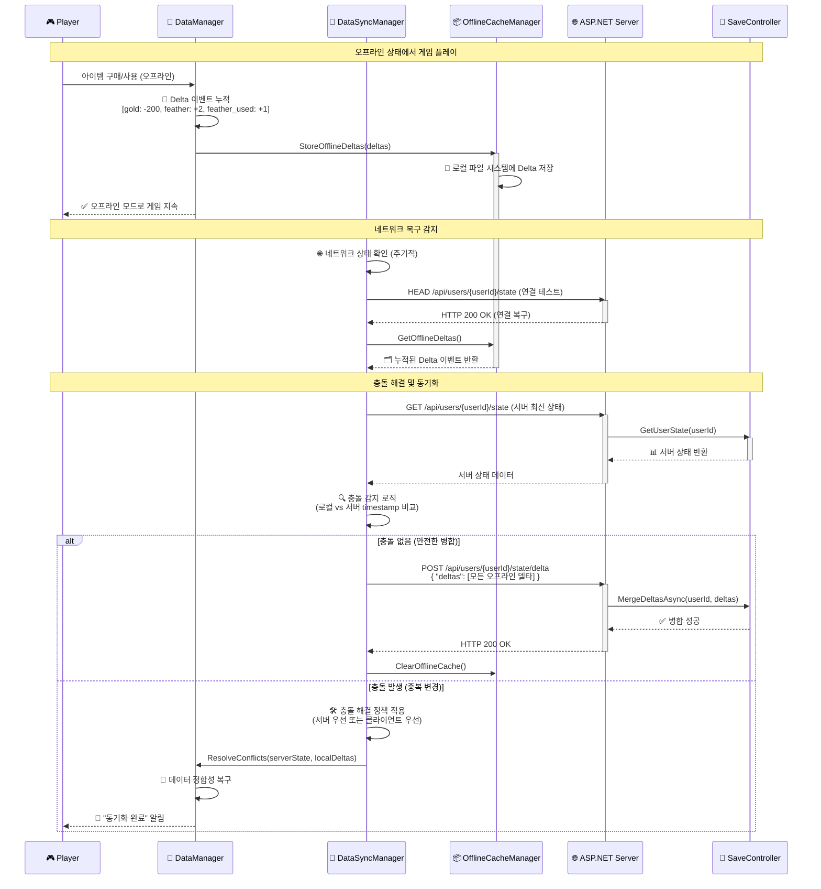

## 아이템·재화 시스템 시퀀스 다이어그램

---

## **📱 클라이언트 내부 흐름 (Local Processing)**

### 1) 상점에서 아이템 구매 흐름
**Player → UI_Shop → CurrencyManager → ItemManager → DataManager → UI 갱신**

### 2) 인게임에서 아이템 사용 흐름
**키 입력 → 사용 가능 체크 → IItemUse 구현체 실행 → 버프 적용 → 데이터 저장 → UI 갱신**

---

## **🌐 클라이언트-서버 통신 흐름 (Network Sync)**

### 3) 아이템 구매 + 서버 동기화 흐름
**로컬 구매 → Delta 이벤트 수집 → 서버 배치 업로드 → 검증 및 동기화**

### 4) 아이템 사용 + 서버 로깅 흐름
**로컬 사용 → 서버 사용 로그 → 통계 업데이트 → 이상 감지 시 동기화**

### 5) 네트워크 단절 + 복구 시나리오
**오프라인 플레이 → 온라인 복구 → 충돌 해결 → 상태 동기화**

---

## **📋 아키텍처 흐름 특징**

### **데이터 동기화 패턴**
- `DataManager` 중심의 **Delta Event System**으로 실시간 동기화
- JSON 저장 → Delta 이벤트 발생 → 관련 Manager들에게 변경 알림
- UI 레이어는 Manager의 이벤트를 구독하여 자동 갱신

### **의존성 역전 원칙**
- `IItemUse` 인터페이스를 통한 **Strategy Pattern** 적용
- `ItemDatabase`가 ScriptableObject와 구현체를 연결
- 런타임에 동적으로 아이템 로직 실행

### **성능 최적화**
- `ItemDatabase` 캐싱으로 반복 에셋 로딩 방지
- 쿨다운 시스템으로 과도한 사용 방지
- Delta 이벤트 배치 처리로 I/O 최적화

### **네트워크 아키텍처 특징**
- **로컬 우선 처리**: 게임플레이 반응성을 위해 클라이언트에서 즉시 적용
- **배치 동기화**: 5초 간격으로 Delta 이벤트 일괄 업로드
- **충돌 해결**: 서버 검증 실패 시 정확한 상태로 강제 동기화
- **오프라인 지원**: 네트워크 단절 시 로컬 캐시, 복구 시 자동 병합
- **보안 검증**: 서버에서 비정상 패턴 감지 및 상태 보정
