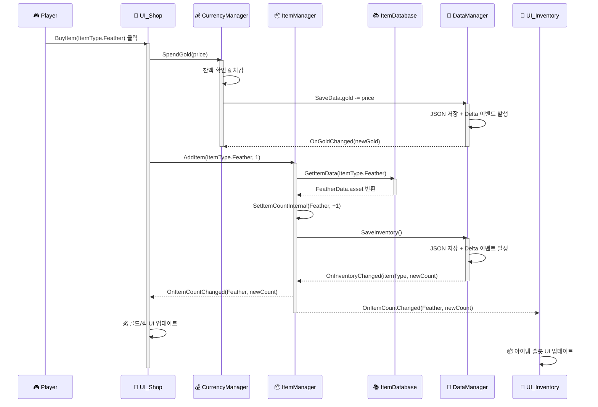
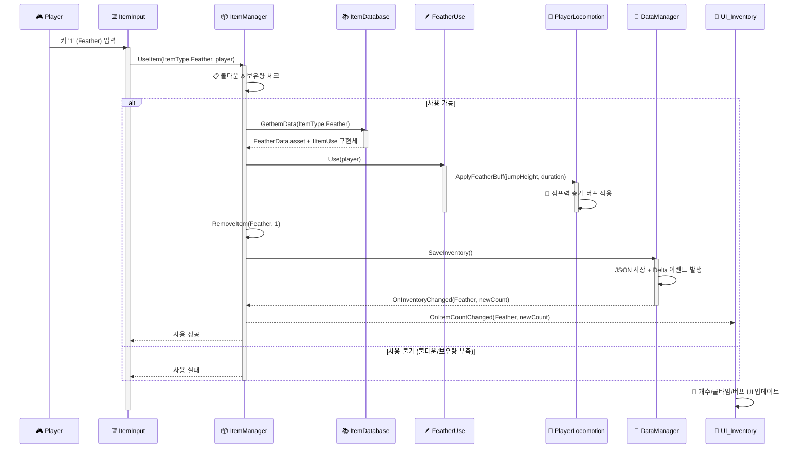

## 아이템·재화 시스템 시퀀스 다이어그램

### 1) 상점에서 아이템 구매 흐름
**Player → UI_Shop → CurrencyManager → ItemManager → DataManager → UI 갱신**

### 2) 인게임에서 아이템 사용 흐름
**키 입력 → 사용 가능 체크 → IItemUse 구현체 실행 → 버프 적용 → 데이터 저장 → UI 갱신**

### 3) 아키텍처 흐름 특징

#### **데이터 동기화 패턴**
- `DataManager` 중심의 **Delta Event System**으로 실시간 동기화
- JSON 저장 → Delta 이벤트 발생 → 관련 Manager들에게 변경 알림
- UI 레이어는 Manager의 이벤트를 구독하여 자동 갱신

#### **의존성 역전 원칙**
- `IItemUse` 인터페이스를 통한 **Strategy Pattern** 적용
- `ItemDatabase`가 ScriptableObject와 구현체를 연결
- 런타임에 동적으로 아이템 로직 실행

#### **성능 최적화**
- `ItemDatabase` 캐싱으로 반복 에셋 로딩 방지
- 쿨다운 시스템으로 과도한 사용 방지
- Delta 이벤트 배치 처리로 I/O 최적화
