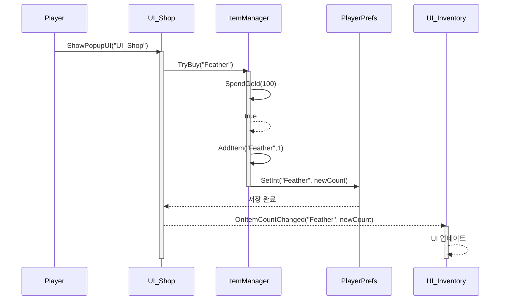
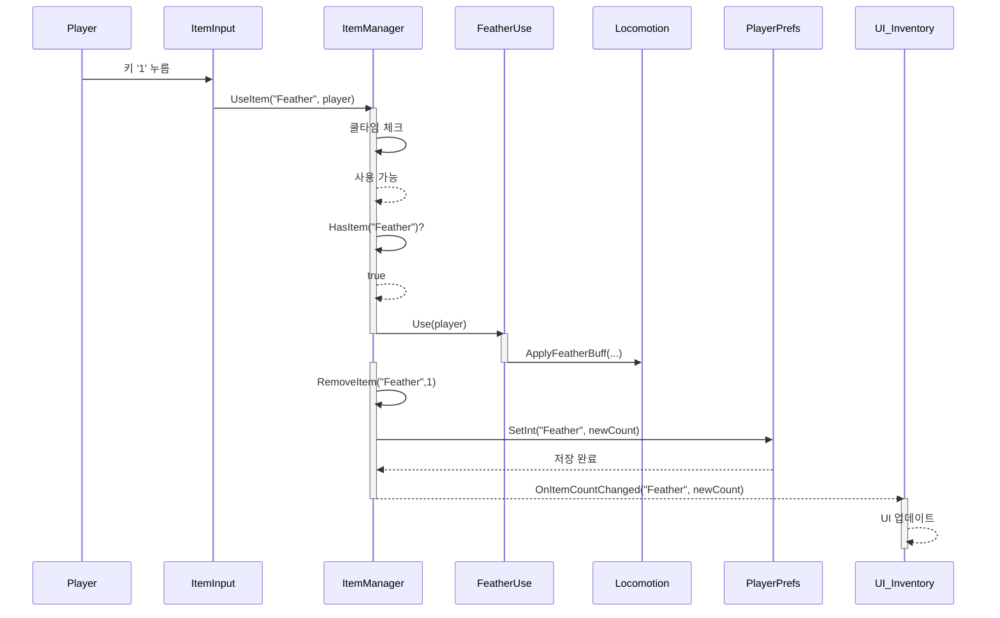

1) 상점에서 아이템 구매 흐름
- Player → UI_Shop → ItemManager → PlayerPrefs → UI 갱신까지의 흐름

```mermaid
sequenceDiagram
    participant 플레이어 as Player
    participant 상점UI as UI_Shop
    participant 아이템매니저 as ItemManager
    participant 저장소 as PlayerPrefs
    participant 인벤토리UI as UI_Inventory

    플레이어->>상점UI: ShowPopupUI("UI_Shop")
    activate 상점UI

    상점UI->>아이템매니저: TryBuy("Feather")
    activate 아이템매니저

    아이템매니저->>아이템매니저: SpendGold(100)
    아이템매니저-->>아이템매니저: true

    아이템매니저->>아이템매니저: AddItem("Feather",1)
    아이템매니저->>저장소: SetInt("Feather", newCount)
    deactivate 아이템매니저

    저장소-->>상점UI: 저장 완료

    상점UI-->>인벤토리UI: OnItemCountChanged("Feather", newCount)
    activate 인벤토리UI
    인벤토리UI-->>인벤토리UI: UI 업데이트
    deactivate 인벤토리UI

    deactivate 상점UI
```

2) 인게임에서 아이템 사용 흐름
-키 입력 → 아이템 존재 여부 확인 → 사용 로직 실행 → 능력 적용 → 저장 및 UI 업데이트

```mermaid
sequenceDiagram
    participant 플레이어 as Player
    participant 입력컴포넌트 as ItemInput
    participant 아이템매니저 as ItemManager
    participant 효과스크립트 as FeatherUse
    participant 이동컴포넌트 as Locomotion
    participant 저장소 as PlayerPrefs
    participant 인벤토리UI as UI_Inventory

    플레이어->>입력컴포넌트: 키 '1' 누름
    입력컴포넌트->>아이템매니저: UseItem("Feather", player)
    activate 아이템매니저

    아이템매니저->>아이템매니저: 쿨타임 체크
    아이템매니저-->>아이템매니저: 사용 가능

    아이템매니저->>아이템매니저: HasItem("Feather")?
    아이템매니저-->>아이템매니저: true

    아이템매니저->>효과스크립트: Use(player)
    deactivate 아이템매니저

    activate 효과스크립트
    효과스크립트->>이동컴포넌트: ApplyFeatherBuff(...)
    deactivate 효과스크립트

    activate 아이템매니저
    아이템매니저->>아이템매니저: RemoveItem("Feather",1)
    아이템매니저->>저장소: SetInt("Feather", newCount)
    저장소-->>아이템매니저: 저장 완료

    아이템매니저-->>인벤토리UI: OnItemCountChanged("Feather", newCount)
    deactivate 아이템매니저

    activate 인벤토리UI
    인벤토리UI-->>인벤토리UI: UI 업데이트
    deactivate 인벤토리UI

```
