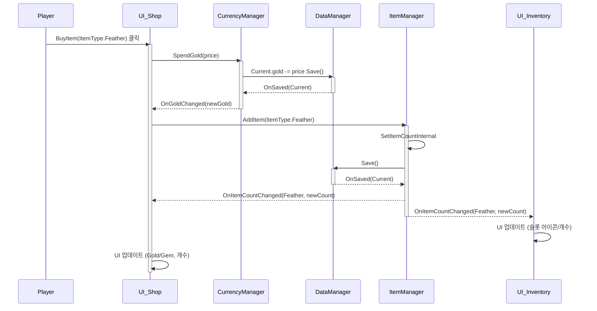
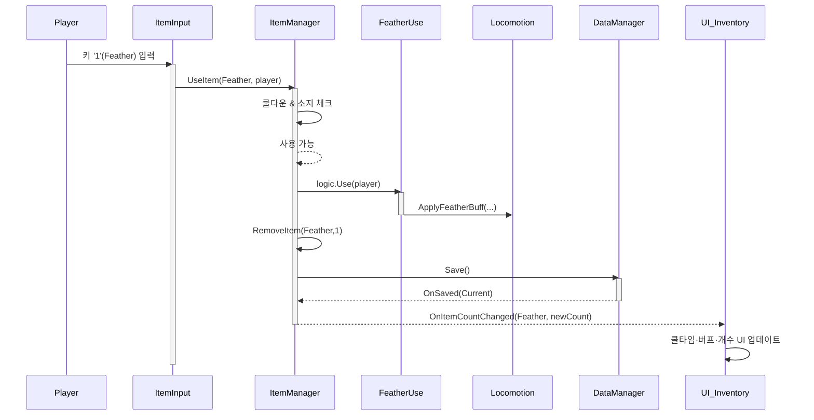

1) 상점에서 아이템 구매 흐름
- Player → UI_Shop → ItemManager → CurrencyManager → DataManager → UI 갱신까지의 흐름

```mermaid
sequenceDiagram
    participant 플레이어 as Player
    participant 상점UI as UI_Shop
    participant 재화Mgr as CurrencyManager
    participant 데이터Mgr as DataManager
    participant 아이템Mgr as ItemManager
    participant 인벤토리UI as UI_Inventory

    플레이어->>상점UI: BuyItem(ItemType.Feather) 클릭  
    activate 상점UI

    상점UI->>재화Mgr: SpendGold(price)  
    activate 재화Mgr

    재화Mgr->>데이터Mgr: Current.gold -= price Save()  
    activate 데이터Mgr

    데이터Mgr-->>재화Mgr: OnSaved(Current)  
    deactivate 데이터Mgr

    재화Mgr-->>상점UI: OnGoldChanged(newGold)  
    deactivate 재화Mgr

    상점UI->>아이템Mgr: AddItem(ItemType.Feather)  
    activate 아이템Mgr

    아이템Mgr->>아이템Mgr: SetItemCountInternal  
    아이템Mgr->>데이터Mgr: Save()  
    activate 데이터Mgr

    데이터Mgr-->>아이템Mgr: OnSaved(Current)  
    deactivate 데이터Mgr

    아이템Mgr-->>상점UI: OnItemCountChanged(Feather, newCount)  
    아이템Mgr-->>인벤토리UI: OnItemCountChanged(Feather, newCount)  
    deactivate 아이템Mgr

    인벤토리UI->>인벤토리UI: UI 업데이트 (슬롯 아이콘/개수)  
    상점UI->>상점UI: UI 업데이트 (Gold/Gem, 개수)  
    deactivate 상점UI

```

2) 인게임에서 아이템 사용 흐름
- 키 입력 → 사용 가능 체크 → 효과(FeatherUse) 적용 → JSON 저장 → UI 갱신

```mermaid
sequenceDiagram
    participant 플레이어 as Player
    participant 입력컴포넌트 as ItemInput
    participant 아이템Mgr as ItemManager
    participant 사용로직 as FeatherUse
    participant 이동컴포넌트 as Locomotion
    participant 데이터Mgr as DataManager
    participant 인벤토리UI as UI_Inventory

    플레이어->>입력컴포넌트: 키 '1'(Feather) 입력  
    activate 입력컴포넌트

    입력컴포넌트->>아이템Mgr: UseItem(Feather, player)  
    activate 아이템Mgr

    아이템Mgr->>아이템Mgr: 쿨다운 & 소지 체크  
    아이템Mgr-->>아이템Mgr: 사용 가능  

    아이템Mgr->>사용로직: logic.Use(player)  
    activate 사용로직
    사용로직->>이동컴포넌트: ApplyFeatherBuff(...)  
    deactivate 사용로직

    아이템Mgr->>아이템Mgr: RemoveItem(Feather,1)  
    아이템Mgr->>데이터Mgr: Save()  
    activate 데이터Mgr

    데이터Mgr-->>아이템Mgr: OnSaved(Current)  
    deactivate 데이터Mgr

    아이템Mgr-->>인벤토리UI: OnItemCountChanged(Feather, newCount)  
    deactivate 아이템Mgr

    인벤토리UI->>인벤토리UI: 쿨타임·버프·개수 UI 업데이트  
    deactivate 입력컴포넌트

```
